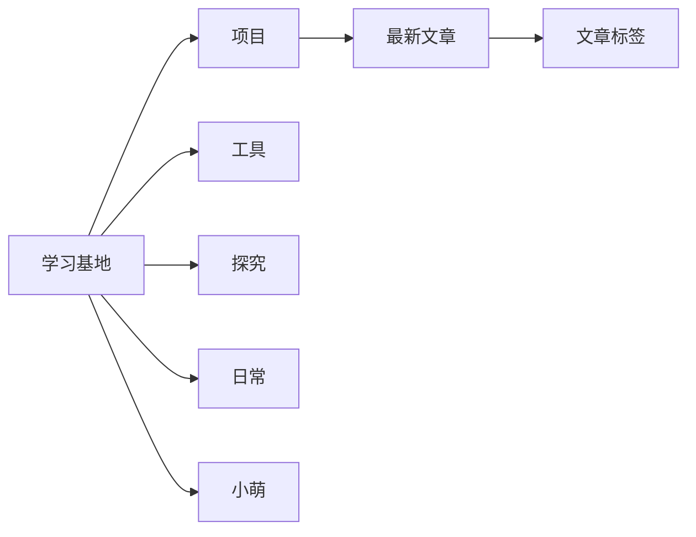
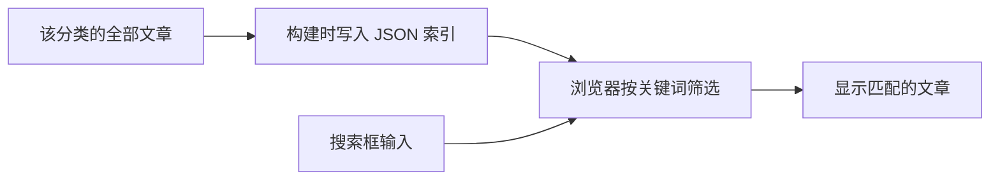
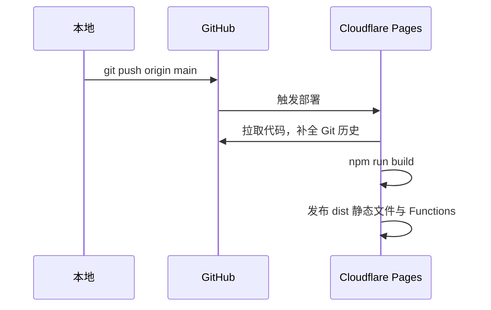
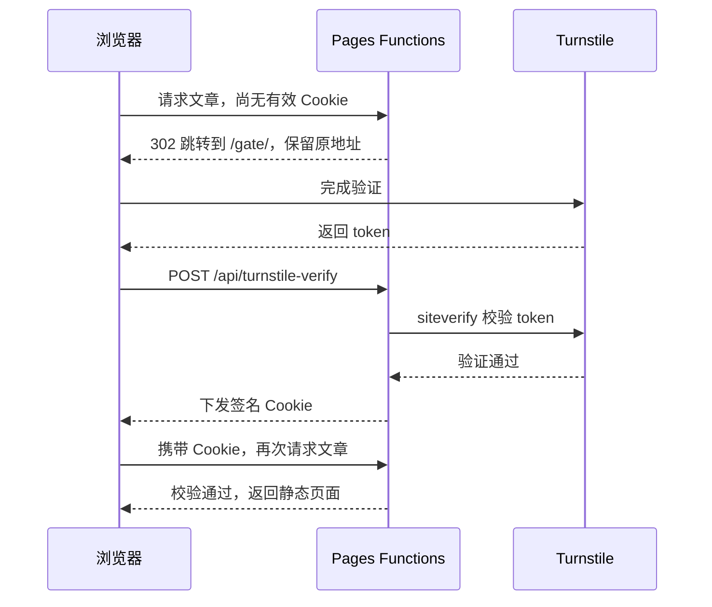

[访问网站](https://www.nuonuoya.cn) · [开发约定](./AGENTS.md)

## 站里有什么

首页是一张可以拖动、缩放的思维导图。点开分类，再展开文章和标签；每类显示最新 5 篇，其余内容从「查看全部」进入。手机上用同一套内容排成竖向树，正常向下滚动。



图中只展开了「项目」这一支，其余分类结构相同。关于页放个人介绍，标签页把不同分类的文章串起来。

列表页可以搜索和翻页。文章页有目录、阅读进度、代码复制、Mermaid 图、前后篇与同标签推荐，也能下载 Markdown 原文。

## 一篇文章怎样变成网页

页面在构建时生成，访问时直接读取 HTML。RSS、sitemap 和 Markdown 下载文件也在这一步产出。


文章放在 `src/content/` 下对应的目录里：

| 目录 | 内容 | 页面 |
| --- | --- | --- |
| `project/` | 项目介绍与开发记录 | `/project/` |
| `tool/` | 工具与使用方法 | `/tool/` |
| `explore/` | 探究与学习笔记 | `/explore/` |
| `daily/` | 日常记录 | `/daily/` |
| `xiaomeng/` | 小萌的资料与设计 | `/xiaomeng/` |
| `profile/` | 个人介绍 | `/about/` |

**不写 frontmatter。** 标题取第一个一级标题，简介取开头的引用，标签和仓库链接各写一行。一个文件可以这样写：

```markdown
# 我的项目笔记

> 这次做了什么，遇到了什么问题。


> tags: [Astro, 静态网站]
> github: https://github.com/用户名/仓库名

## 从这里开始写正文

正文……
```

这些元信息会从正文中剔除。封面优先取开头的图片，没有就取正文第一张；文件名以 `_` 开头时作为草稿，不会发布。

日期优先用文件名中的 `YYYY-MM-DD-` 前缀，否则读取 Git 中最近一次实际修改内容的时间，跳过纯改名。新文件还没有提交记录时使用文件修改时间，页面按台北时间显示。

图片使用 OSS 完整外链。首页封面走 `thumb` 缩略图样式，列表和文章页使用原图。完整格式见 [文章模板](./src/content/content_format.md) 和 [个人介绍模板](./src/content/profile_format.md)。

## 搜索怎样工作

搜索不请求服务器。构建时，列表页把当前分类的全部文章做成 JSON 索引；输入关键词后，浏览器直接筛选并显示结果，范围不限于当前页。



索引包含标题、简介、分类、标签和正文前 500 个字符，适合找文章，不是全文搜索。

## 提交后怎样上线

站点使用 Astro 5，构建输出目录是 `dist/`。Cloudflare Pages 连接 GitHub 的 `main` 分支，推送后自动构建和发布。



构建命令会先运行 `scripts/unshallow.mjs`。Pages 的浅克隆缺少旧提交，直接构建会让文章日期失真；补全历史后再生成页面，补全失败就停止构建。

域名是 `www.nuonuoya.cn`，裸域跳转到 www。DNS 保留在阿里云，www 通过 CNAME 指向 Pages，HTTPS 由 Cloudflare 提供。

## 进站验证怎样工作

正文是静态的，访问验证由 Pages Functions 处理。首次访问先进入极简 Turnstile 验证页；验证通过后，浏览器拿到一个有效期 24 小时的 HMAC 签名 Cookie，再回到原先要看的页面。



Cookie 有效时直接放行；两个验证 Secret 未配齐时也会放行，避免配置遗漏把站点锁死。旧分类链接在验证前做 301 重定向。

## 本地运行

使用 Node.js 22：

```powershell
npm install
npm run dev
```

开发地址是 `http://127.0.0.1:4321`。`astro dev` 只运行站点页面，不运行 Pages Functions。

构建与预览：

```powershell
npm run build
npm run preview
```

Pages 使用 `npm run build`，输出目录设为 `dist`，Node 版本设为 `22`。Turnstile 还需要这些环境变量：

| 变量 | 用途 |
| --- | --- |
| `PUBLIC_TURNSTILE_SITE_KEY` | 构建进验证页的公开 Site Key |
| `TURNSTILE_SECRET_KEY` | 服务端校验 token |
| `GATE_COOKIE_SECRET` | 签名与校验放行 Cookie |

修改内容、页面或配置前，先读 [AGENTS.md](./AGENTS.md)。里面保留了当前约定和已踩过的坑。
