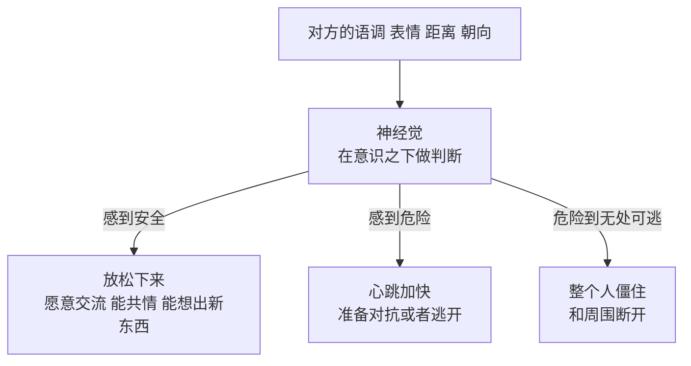
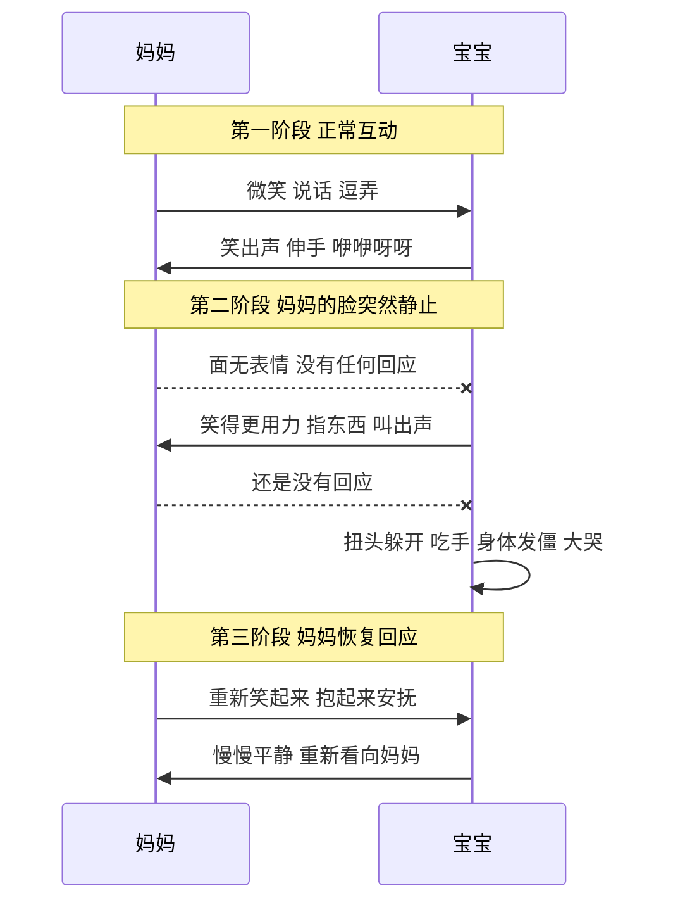
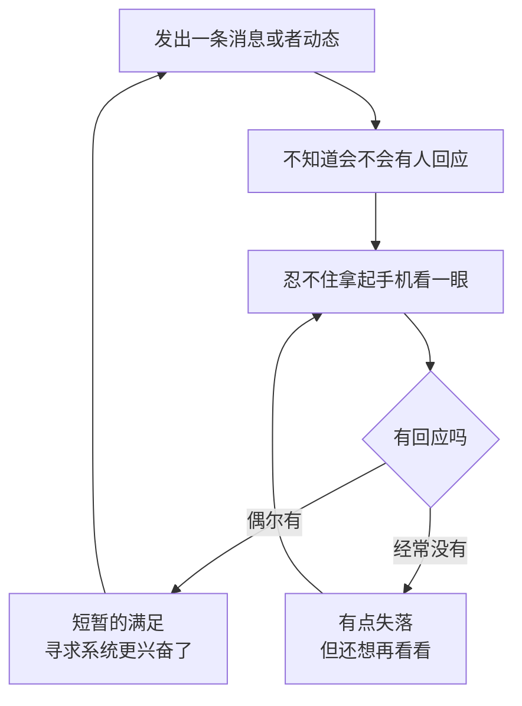
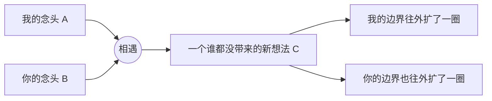
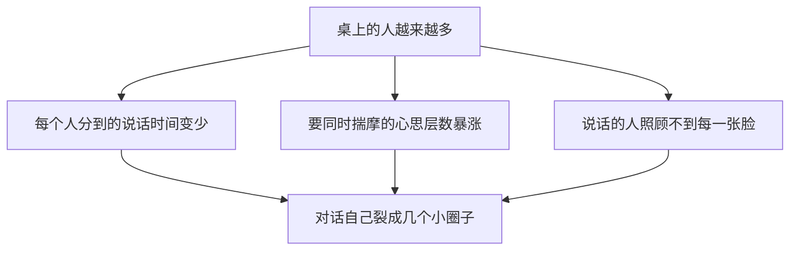
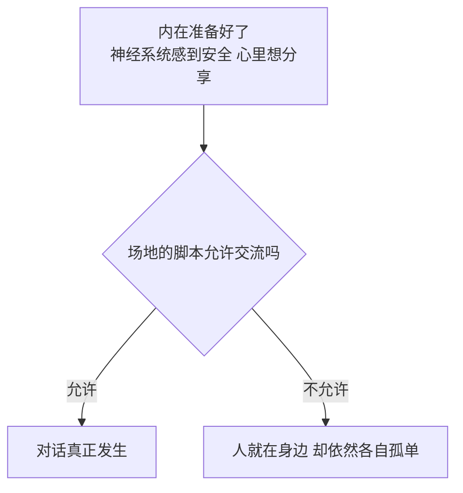
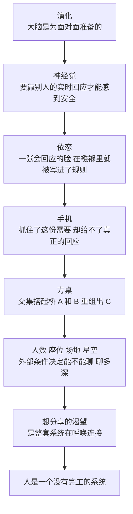
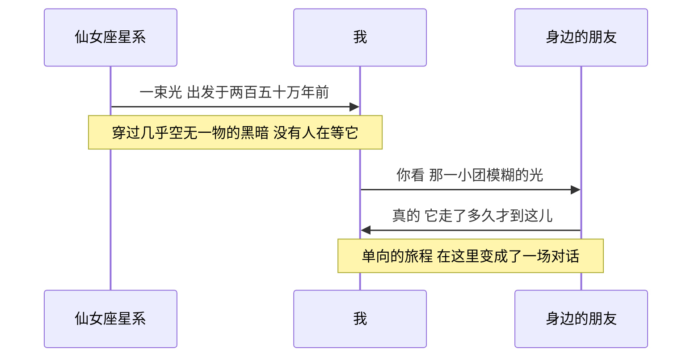

# 从一杯冰果茶，到一束走了两百五十万年的光

> 我一直更喜欢和朋友坐下来面对面地聊天，可网络明明这么方便，我也说不清到底为什么。于是我顺着这个问题一路往下挖，从大脑的演化挖到婴儿的眼神，从一张四方桌挖到头顶的星空。这篇是我把这一路想明白的东西，一步一步写下来的记录。

***

***

> tags: [心理学, 人际交流, 演化心理学, 依恋理论, 环境心理学, 天文, 随笔]

## 夏天，一张四方桌，四杯冰果茶

我脑子里一直有这样一个画面。

夏天最热的那几天，四个朋友找了家店坐下。桌子是方的，一人占一边。每个人面前一大杯果茶，冰块放得很足，杯壁上挂满了水珠，稍微一晃就叮当响。

这四个人喜欢的东西完全不一样。一个喜欢天文，一个喜欢地理和探险，一个天天追科技新闻，还有一个特别会过日子，做饭、收拾屋子这些事情样样讲究。

然后大家就开始聊。聊到哪算哪，没人定主题，也没人赶时间。

我特别喜欢这种场景。可后来我越想越觉得这件事有点奇怪。今天想跟人说话，打开手机几秒钟就能发出去，隔着半个地球也能视频。按道理说，交流这件事早就被技术解决得很彻底了，那为什么我，还有身边一些很正常的人，还是觉得坐下来面对面地聊更好？

我最开始的答案很朴素：屏幕传不过去人和人之间的情绪，也传不过去肢体语言。

这个答案我现在也认，但它只是一个感觉，并没有解释什么。情绪和肢体语言为什么对我们这么重要？少了它们，到底少的是什么？我决定顺着这个问题往下挖，一层一层地挖，不跳步。

## 我们的大脑，比屏幕老太多了

要回答"为什么面对面更舒服"，第一步我觉得得先往回看，看看人类交流用的这些工具，是按什么顺序出现的。

表情、眼神、姿态这一套信号，是灵长类动物花了几千万年慢慢打磨出来的，它比"人"这个物种本身还要老。开口说话要晚得多，至于语言到底是什么时候出现的，学者们的估计差得很远，从几万年到几十万年都有。文字就更新了，最早的文字到今天大约五千年。而我们每天在屏幕上打字聊天，满打满算也就是这几十年的事。

把这几段时间摆在一起，差距大得有点吓人。

这说明什么呢？我们大脑里负责理解别人的那套机制，绝大部分是在"对方就在眼前"的条件下被塑造出来的。文字和屏幕对它来说都是很晚才冒出来的新东西，大脑处理它们的时候，用的还是那套为面对面准备的老电路。所以打字聊天会丢信息，怪不到谁打字不认真头上，我们的硬件本来就没为这个做过准备。

英国人类学家罗宾·邓巴有个我很喜欢的解释。他研究灵长类的时候注意到，猴子和猩猩每天要花大量时间互相理毛。理毛不光是为了干净，它会让双方放松下来，建立信任，把关系维系住。问题是理毛只能一对一，群体一大就忙不过来了。邓巴认为，人类的语言，尤其是那些看起来没什么用的闲聊，很可能就是理毛的升级版，一张嘴可以同时照顾好几个人的关系。他的团队后来还做过实验，发现一群人一起笑过之后，对疼痛的忍耐度会变高，这通常被看作身体释放了内啡肽的迹象。

还有一层跟信任有关。人要合作，就得判断对方靠不靠得住。语气里一瞬间的迟疑，脸上一闪而过的不自然，这些很难装，也很难通过文字传过来。面对面的时候，我们收到的是一份高清版本的对方。

走到这里，我大概明白了人为什么会有这种偏好。但演化讲的是几百万年尺度上的事，它没回答另一个问题：当我真的坐在朋友对面的那一刻，我的身体里到底发生了什么？

## 身体比我先做了判断

这一层我找到的是美国神经科学家斯蒂芬·波格斯提出的一个说法，他管它叫"神经觉"。

我们平时说的知觉，是意识得到的东西，比如我看见了一杯茶。神经觉不一样，它发生在意识下面，是神经系统一直在后台默默做的一件事：判断眼前这个环境、这个人，到底安不安全。

它判断的依据很细。对方说话的语调是柔和的还是紧绷的，眼睛周围的肌肉是松的还是僵的，离我有多远，身体朝着哪边。这些东西不用刻意去看，神经系统自己就收集好了，然后把人推进三种状态里的一种。

我觉得最关键的是第一种。人只有在神经系统判定"这里安全"的时候，才真正放得开，才有耐心去听，才有余力去共情，脑子里才会冒出新的想法。

而要触发这份安全感，靠的恰恰是实时的、来回的细小信号。我说话的时候你的表情跟着在变，我看你皱了一下眉，就会下意识地放慢；你看我笑了，也就跟着松下来。这种来回可能只有几百毫秒，神经系统就是靠它来确认"可以卸下防备了"。

打字聊天刚好把这条来回的通路剪断了。对方的话再温柔，神经系统也拿不到它要的那些信号，于是会一直停在一种轻微的待命状态。这大概就是为什么有时候线上聊得挺好，心里还是有点悬着，少了那种被接住的踏实。

这里我得说句公道话。波格斯这套理论在学界争议不小，特别是讲迷走神经怎么演化的那部分，很多生理学家并不认同。但它描述的那个现象，也就是人会在意识到之前先对环境做一次安全判断，跟不少其他研究是对得上的。所以我把它当成一个观察的角度，不当定论。

新的问题跟着就来了。这个判断安不安全的系统，是天生就有的，还是后来学会的？它是什么时候装进我们身体里的？

## 这套系统，在襁褓里就装好了

顺着这个问题，我找到了依恋理论。

上世纪中叶，英国精神科医生约翰·鲍尔比提出了这个理论。当时流行的看法是，婴儿粘着妈妈是因为妈妈喂他奶，爱是跟着食物来的。鲍尔比不这么看。他注意到，婴儿就算吃饱了，依然强烈地需要被抱着，被看着，被回应。他认为这是一套独立的生存机制：婴儿自己什么都做不了，只有牢牢绑定一个可靠的大人才能活下来，所以大脑天生就会去找这个人，并且时刻确认，这个人对我有没有反应。

差不多同一个时期，美国心理学家哈里·哈洛用恒河猴做了一个很有名的实验，今天看来有点残忍。他给小猴子准备了两个假妈妈，一个是铁丝做的，上面挂着奶瓶；另一个用软布包着，没有奶。结果小猴子只在饿的时候跑到铁丝妈妈那里喝几口，其余时间几乎都抱着软布妈妈不撒手。温暖和贴近，比食物更能决定它依恋谁。

真正把依恋理论和上一节那个安全判断焊在一起的，是美国心理学家爱德华·特罗尼克在上世纪七十年代做的静止脸实验。

流程很简单。妈妈先跟几个月大的宝宝正常玩一会儿，笑，说话，逗他。然后妈妈突然把表情关掉，面无表情地看着宝宝，不管宝宝做什么都不回应，大概持续两分钟。

宝宝的反应几乎每次都差不多。一开始他会加倍努力，笑得更使劲，伸手，指东西，发出声音，想把妈妈叫回来。这些都没用之后，他就开始崩了，扭头躲开，吃手，身体发僵，最后大哭。整个过程往往用不了两分钟。

读到这个实验的时候，最让我受冲击的是一个细节：妈妈没有离开，没有凶他，什么坏事都没发生，唯一的变化只是那张脸不再回应了。光是这一点，就足以让一个小婴儿从安心掉进恐慌。

也就是说，"一张会回应我的脸"，在生命最早的那几个月里，就已经被写成了判断安全和危险的底层规则。这可比长大以后学的那些社交礼节早得多，也牢得多。

特罗尼克后来的研究里还有一个让我很意外的发现。哪怕是很正常、很健康的母婴互动，两个人也并不是一直同步的。有一种说法是，真正对上的时间大概只有三成，大部分时间都在对不上，然后又重新对上。他认为，关系的韧性恰恰就是从这一次次修复里长出来的。

这句话我琢磨了很久。原来好的交流从来不是完美同步，而是出了偏差能马上被拉回来。面对面聊天的时候，我一句话没说清楚，看你一脸疑惑，立刻就能补一句"我不是那个意思"。线上这个修复要慢得多，有时候误会就在等回复的那几个小时里越长越大。

鲍尔比把这一次次互动在心里沉淀下来的东西，叫做"内部工作模型"，大致可以理解为一套潜意识里的模板：别人会不会回应我？我值不值得被回应？这套模板会一路跟着我们长大，被带进以后所有的亲密关系里。

后来也有研究者借用静止脸实验的思路，去看父母低头玩手机时孩子的反应。还有研究发现，经常被伴侣冷落给手机的人，对这段关系的满意度会更低。我猜，成年人被已读不回刺痛的那一下，很可能就是襁褓里那套警报在今天又响了一次。

写到这里，我脑子里冒出一个有点不舒服的问题。既然我们对"回应"这么敏感，那如果有人专门围绕这份敏感去设计产品，会发生什么？

## 当这套古老的系统，遇上了手机

先说一个行为心理学里很老的发现。斯金纳做动物实验的时候发现，如果每按一次杠杆都能得到食物，动物按一阵子就没那么积极了；可如果奖励是随机的，有时候有，有时候没有，动物反而会一直按，停都停不下来。这就是后来常说的间歇性强化，老虎机就是照着这个原理设计的。

发一条动态，然后等点赞和评论，其实是一回事。你不知道什么时候会有人回，也不知道会有几个人回，于是隔一会儿就想看一眼。神经科学家雅克·潘克塞普把大脑里负责"去找"的那套回路叫做寻求系统，它最兴奋的时刻不在得到的时候，而在"好像快要得到了"的时候。不确定的回应，刚好让它一直停在那个时刻。

已读回执是我觉得最微妙的一个设计，它刚好能对上静止脸实验。以前没有"已读"两个字的时候，对方没回，我可以替他找理由，也许没看到，也许在忙，心里留着余地。"已读"把这点余地堵死了。我明确知道你看到了，你也有能力回，可你就是没回。这太像那张"人还在，脸却不动了"的静止脸了，所以它刺痛人的程度，常常比单纯的沉默更深。这是我自己的理解，但我觉得挺说得通。

还有无限下拉的信息流。动物觅食有一种本能，一片地方的食物越找越少，它就知道该换地方了，会自己停下来。算法信息流偏偏把这个"该停了"的信号拿掉了，下一条永远可能更好。有意思的是，无限下拉的设计者阿扎·拉斯金后来自己公开说过，他很后悔。

把这些放在一起，我得出一个有点凉的结论：这些设计瞄准的，恰恰就是我们用来维系亲密关系、确认"有没有人在乎我"的那套古老系统。可它们给回来的东西非常稀薄，一个红点，一个数字，一颗心。它能把那套系统勾起来，却完成不了真正的安全确认。有点像拿糖水去喂一个需要营养的人，喝的时候是甜的，喝完还是饿。所以人会一直刷，一直填不满。

不过话也不能说死。线上交流丢掉的东西是真丢了，但它换来的东西也是真的。半夜突然冒出一个念头，线下这时候没人陪我，线上却能随时接上；隔着几千公里的朋友，靠着一条条消息也能不断线。我现在更愿意这样看：线下负责深度，线上负责频率。线上是两次见面之间的那座桥，替代不了见面本身。

那么，线下到底给了我什么线上给不了的东西？我想回到那张四方桌，仔细看看桌上正在发生什么。

## 话题是怎么在四个人之间流动的

冰块在杯子里碰了一下。

喜欢天文的那位先开口，说这几天是英仙座流星雨的极大期，找个暗一点的地方能看到不少。喜欢探险的那位眼睛一下就亮了，说他之前专门跑去沙漠边上看过一次，顺带讲起那回跟着向导差点迷路的糗事。会过日子的那位本来在嚼冰块，突然插了一句：那你们夜里去，得带点热的，沙漠晚上冷，煮壶姜茶正好。追科技新闻的那位马上接上：现在有些望远镜能用算法自动识别流星的轨迹，回头把资料发给你们。

就这样，四个人从星星聊到沙漠，从沙漠聊到姜茶，又从姜茶聊到算法。中间有人笑场，有人打断，有人说"等等，你让我先说完"。

如果这四个人是在网上，大概率会各自待在天文论坛、旅行群、科技资讯和美食账号里，互相碰不到。线上的结构天然是按主题分区的，推荐算法也更愿意把你留在你已经喜欢的东西里。可一张桌子一坐，话题是跟着人的联想和脸上的反应自己漂的，一个人的兴趣会顺着聊天的劲头，蹭进别人的领域里去。"流星雨配姜茶"这种组合，我很难想象有人会专门打字打出来，它只会在顺嘴一说的时候冒出来。

我盯着这个过程看了很久，发现一件事：四个人领域完全不同，但聊着聊着，会本能地找到一块大家都能插上话的公共区域，在那块区域里谈；实在没有，就顺着其中一个人稍微往外延伸一点。

语言学家赫伯特·克拉克把这块区域叫做"共同基础"。两个人聊天，一直在做一件事：不断确认"这个我们俩都懂"，然后在这个基础上往前走。社会心理学里还有一个更早的发现，人天然会被跟自己相似的人吸引，重叠的地方越多，越容易觉得投缘。

于是我慢慢形成了一个自己的模型。每个人都有一片属于自己的范围，两个人一交流，两片范围就会有交集。交集足够大的时候，共鸣就被触发了。

但我很快发现，这个模型里藏着一个细节。交集太小当然聊不起来，可交集要是太大，也挺无聊，大家都懂的东西，就没什么好说的了。天文和做饭本来几乎没有交集，也正因为这样，"流星雨配姜茶"才让人眼前一亮。

所以真正让人聊得起劲的，好像并不是交集有多大，而是交集刚好够搭一座桥，桥那头还有一大片我没见过的地方。太陌生连不上，太熟悉又没意思，卡在中间那个位置最上头。

那桥搭上以后呢？两个人在桥上碰面的那一刻，到底发生了什么？

## A 碰上 B，长出了 C

我想到一个 A，你想到一个 B，单独看都很普通。但它们碰到一起，变成了一个新的想法 C。这个 C 不属于我，也不属于你，它只存在于我们俩之间。有了 C，我们各自的边界都往外扩了一圈。

所以我觉得"思想碰撞"这个说法还不够准，更贴切的说法是"重组"。碰撞听起来像两个东西撞一下又各自弹开，重组是两块东西拼在一起，拼出了第三样东西。

交流在这个意义上很像钥匙。单独一把钥匙哪儿也打不开，两把对上了，齿咬住了，才能打开一扇谁单独都进不去的门。更妙的是，你在用自己那把钥匙的同时，也在不知不觉地递给对方一把，让他去开一扇他自己都不知道存在的门。

历史上，这样的门被打开过很多次。

DNA 双螺旋结构的发现，靠的是沃森和克里克在剑桥没完没了的争论，互相画草图，互相推翻对方的模型，也离不开罗莎琳德·富兰克林拍下的那张关键的 X 射线衍射照片。那不是一个人闷头算出来的，是好几个脑子来回撞出来的。

十八世纪英国伯明翰有个小圈子，叫月光社。蒸汽机的瓦特、做陶瓷的韦奇伍德、发现氧气的普里斯特利，还有达尔文的祖父伊拉斯谟斯·达尔文，都在里面。他们每个月挑离满月最近的那天晚上聚在一起吃饭聊天。选满月是因为那时候没有路灯，月亮亮一点，散场以后骑马回家安全些。很多影响了工业革命的想法，都在这张饭桌上被反复聊过。

二十世纪的贝尔实验室，诞生过晶体管，也诞生过香农的信息论。据说它在新泽西的那栋主楼，走廊特意修得很长，就是为了让不同部门的人在去食堂、去办公室的路上不得不碰面。很多想法就是在走廊里、饭桌上随口聊出来的。

这几个场景跟那张四方桌出奇地像：没有议程，没有指标，大家只是因为凑在一起舒服才坐下来，而且是反复地、长年累月地坐下来。反倒是那种专门召集起来"现在开始头脑风暴"的会议，在心理学实验里的效果常常比不上大家各自先想、再汇总。这个原因，后面讲到人数的时候我会说。

到这里，我可以试着给交流下一个自己的定义了。我觉得每一次真正的交流里，都同时发生着两件事。

第一件，是确认彼此的存在。我说话的时候你真的在听，你的反应是活的，不是延迟的，也不是演出来的。这件事跟聊什么关系不大，它给人的是一种"我被看见了"的踏实。

第二件，才是重组。两个人的知识和联想，在那一刻被现场拼成了一样新东西。

而喝果茶、闲聊、天南海北地扯，其实是在搭一个门槛很低的容器。没有目的，没有台本，不用把话组织到完美。正是这种松弛，让第一件事和第二件事都有机会发生。线上打字天然带着编辑和修饰，发出去的往往是想清楚之后的结论，想的过程本身被省掉了，而最有意思的恰恰是那个过程。

那问题又来了：同样是聊天，为什么有的饭局热火朝天，有的却冷冷清清？除了人本身，还有什么在影响这件事？我想先从一个最简单的变量看起，人数。

## 为什么偏偏是四个人

我当初想象那个场景的时候，很自然地选了四个人，没选八个。后来才知道，这个直觉背后是有东西的。

邓巴和同事观察过人们在各种场合自发形成的聊天小组，发现一场对话能容纳的人数有一个很稳定的上限，大约就是四个人。超过这个数，对话几乎一定会自己裂开，变成两三个小圈子各聊各的。

为什么会这样？我拆成了三层来理解。

第一层最朴素，是说话的机会。说话是一个单通道的东西，任何一个瞬间，大家只能听清一个人。人越多，每个人分到的说话时间就越少，憋着的那句话一直轮不到自己，等待的代价越来越高，人自然就想找个小一点的圈子把话说出去。前面说头脑风暴会议效果常常不好，一个很重要的原因就在这儿：一个人说的时候，其他人只能一边等一边把自己的想法憋着，憋着憋着就忘了，或者不想说了。

第二层是脑子的负担。真正流畅的聊天，尤其是开玩笑、说反话、心照不宣的那种，需要同时想好几层：我在想什么，你觉得我在想什么，他以为你觉得我在想什么。心理学里把这种揣摩别人心思的能力叫做心智化，桌上每多一个人，要追踪的层数和组合就陡然多出一截。邓巴认为，普通人在真实的聊天速度下能扛住的层数是有上限的，这个上限，恰好和四个人左右的对话规模对得上。超过了，脑子就开始丢帧，对话就会自己拆成几个更轻松的小组。

第三层，要回到最开始说的实时反馈。说话的人需要一边说一边扫视大家，看这句话有没有被接住。可人眼真正能看清表情的范围很窄，同一时间只能照顾到很少几张脸。人一多，总有几张脸会掉出你的视线。对那几个人来说，他们和你之间那条来回的通路就断了，他们会本能地转向身边的人，重新找一个能看见自己的小圈子。

三个瓶颈一起挤压，四个人，差不多就是它们都还没被挤爆的最大人数。

## 从两个人到四个人，变的不只是人数

但如果只看"人越多越难"，我觉得还是看浅了。在几个关键的节点上，交流会发生质的变化。

德国社会学家齐美尔很早就注意到，从两个人变成三个人，是人际关系里最剧烈的一次跳变。

两个人的关系完全依附于这两个具体的人，任何一方离开，这段关系就不存在了。所以两个人之间的交流最深，也最脆弱，没有地方可以躲，沉默落下来的时候也最重。

第三个人一加进来，一些之前不可能存在的东西就出现了。可以有人结盟，变成二对一；可以有人出来调解；还可以出现齐美尔说的那种"渔翁得利的第三方"，在另外两个人的张力之间左右逢源。更重要的是，三个人的小群体第一次有了不依附于任何一个人的身份，走掉一个，剩下两个人的关系还在。

到了四个人，又往前走了一步。四个人第一次可以分成二对二这种对称的格局，也第一次出现了"一个人脚踩两条对话线"的桥梁角色。比如喜欢天文的那位，一边接探险那位的话头，一边用余光留意做饭那位是不是想插嘴。对话从一条线，变成了一张网。

这里有个反直觉的地方，刚好能接上前面那个交集模型。人越多，维持一场共同的对话越难；可一旦真的有个话题同时击中了四个人，比如"流星雨配姜茶"，它的分量反而比两人对话里一拍即合的话题重得多。两个人找到共鸣，门槛本来就低，很容易舒舒服服地待在小交集里。四个人要让四条完全不同的兴趣线同时被一句话打中，难度就陡增了。这有点像信息论里的一个想法：越不容易发生的事，一旦发生，带来的信息量就越大。所以四人桌上偶尔蹦出来的神来之笔，往往比两人小酌时聊出来的东西更让人惊艳，代价是这种时刻来得更少，更需要默契。

还有一层是心理上的。社会心理学家扎荣茨总结过一个规律：有旁人在看的时候，人做已经很熟练的事会做得更好，做还不熟练、需要摸索的事反而会做得更差。放到聊天里就是，看着你的人越多，你讲那些想清楚了的、说得利落的观点就越带劲，可那些还没想明白、有点脆弱、试探性的念头，就越不敢说出口。

这大概也解释了为什么有些话只适合两个人的时候说。人一多，交流会不自觉地往安全、体面、接得住的方向收。

所以人数这个变量是在两条线上起作用。一条是带宽，说话的机会、脑力、目光，都有上限。另一条是关系的结构和心理上的暴露程度：两个人负责深，三个人开始有了格局，四个人开始有了网络，也有了高风险高回报的碰撞。

说完了人，我想把镜头稍微拉远一点，看看他们坐的那张桌子。

## 为什么是一张四方桌

环境心理学家罗伯特·索默在上世纪做过很多关于座位的研究。他观察过医院食堂里的人怎么坐，也让人挑选自己在不同情境下想坐的位置。结果大致是这样：隔着桌角斜着坐，也就是两个人呈九十度的时候，聊天发生得最多，眼神接触很自然，想看就看，想移开也不尴尬；正对面坐，眼神就直接得多，容易聊得深，也容易带出一点针锋相对的味道，人们要竞争的时候更愿意这么坐；并排坐更适合一起干一件事，却不太适合聊天。

四方桌的妙处就在这里。四个人里任意两个，要么是相邻的九十度，要么是对角的一百八十度。一张桌子上，同时存在着"轻松协作"和"直接交锋"两种关系。喜欢天文的和喜欢探险的如果刚好坐对角，聊起来可能更容易擦出你来我往的火花；跟邻座聊，则更像顺着对方往下接，一起把一个想法搭起来。

这些东西放进视频通话的格子里，全被抹平了。每个人都正对着摄像头，没有邻座，没有侧脸，没有远近。更要命的是，视频里其实没法真正对视：你看着屏幕上对方眼睛的时候，目光并没有对着摄像头，对方看到的你，眼神永远是偏的。大家的脸都清清楚楚，方桌上那种忽远忽近、有层次的关系，却没了。

再把镜头往远拉一点，桌子摆在哪儿，也很要紧。

## 场地也在悄悄替我们做决定

我有一个很直接的观察：在会议室里，大家会很自然地开口；可在图书馆里，哪怕周围坐满了人，每个人也都是一个人。

生态心理学家罗杰·巴克在美国堪萨斯的一个小镇上，花了很多年记录人们在各种地方的日常行为。他得出一个挺颠覆的结论：想预测一个人接下来会怎么做，知道他在哪儿，往往比知道他是谁更管用。同一个人在教堂里、球场上、杂货店里，行为的差别可能比两个不同的人之间的差别还大。巴克把这些地方叫做"行为场域"，每个场域都自带一套行为脚本，这套脚本的约束力，常常比人的性格还强。

图书馆的脚本写的是：安静，各看各的。所以哪怕别人就坐在三米外，那也只是一群人合租的孤独，身体不孤单，心是孤单的。会议室的脚本写的是：这个房间存在的意义就是说话。人一进去，默认就是要开口的。

社会学家雷·奥尔登堡提过一个概念叫"第三空间"。家是第一空间，工作和学校是第二空间，咖啡馆、茶馆、小酒馆这样的地方是第三空间，它们的脚本明明白白写着：随便坐，随便聊，熟人陌生人都行。那张四方桌所在的小店，就是一个第三空间。挑一个允许聊天的地方，再专门空出一段时间，等于是亲手把"可以连接"的那个开关打开。

这样一拼，整件事就完整了。

内在准备好了，场地也允许，两个条件缺一不可。两个人再想说话，被放进一个脚本不允许说话的地方，照样什么都发生不了。这可能也是为什么有些人明明住在一起，却依然觉得孤独。同在一个空间，那个开关从来没被打开过。

可场地的作用还不止允不允许说话。我发现有些地方，会直接决定话题往哪儿走。

## 草地和星空，会把话题往深处拽

走到一片草地上，我会忍不住去感受风和阳光，跟身边的人聊怎么过日子，聊生活里那些细小的感受。

站到星空下面，我会跟身边的朋友说：你看那颗星，它的光在宇宙里走了那么久才到我们这里。那种空旷，那种浩渺，是真的会让人心里一震。

后来我知道，这种感觉在心理学里有个专门的名字，叫敬畏。伯克利的心理学家达谢尔·凯尔特纳和同事对它做过很系统的研究，他们认为敬畏有两个核心。

一个是浩瀚。可以是空间上的大，星空、山脉、大海；也可以是时间上的大，比如一束光走了几千年才落进你的眼睛。

另一个是装不下。这个浩瀚的东西塞不进你平时理解世界的那套框架，脑子不得不被撑开一点，才能勉强容纳它。那一瞬间说不出话的感觉，就是撑开正在发生。

说到星光，我想顺便把数字说准一点。夜里肉眼能看到的那些星星，光大多走了几十年到几千年。如果你在足够暗的地方找到了仙女座星系，那一小团模糊的光斑，它的光出发的时候，地球上还没有现代人。那束光走了大约两百五十万年。

敬畏会带来一个很有意思的效应，可以叫它"小我"。在浩瀚面前，人会觉得自己变小了，平时占满脑子的琐事、面子、计较，一下子显得无足轻重。心理学家保罗·皮夫他们做过一个实验，让一组人在校园里抬头看一片高大的桉树林，只看一分钟；另一组人看的是旁边一栋普通的楼。之后实验人员假装不小心把一把笔撒在地上，看过树的那组人帮忙捡得更多。

人在觉得自己渺小的时候，反而更愿意靠近别人。因为那一刻的共同感受是：我们都只是这片浩瀚里很小很小的存在。人和人之间的那点隔阂，就被碾平了一些。社会学家涂尔干描述过一种状态，一群人被同一件事震撼，情绪一起沸腾起来，他用这个来解释宗教仪式和篝火为什么能一下子拉近一群人。星空下的谈话，走的是同一条路。

还有个小细节挺巧的。前面说过，并排坐本来不太适合聊天。可两个人并肩坐在草坡上看星星的时候，谁也不用看谁，头顶那片天就是共同的注视对象，它替代了对视，话反而说得更自在。

所以场地的脚本分两层。图书馆和会议室决定的是能不能说话；草地和星空决定的是话会被拽到多深。星空下几乎不可能去聊今天股票涨了还是跌了，脑子已经被撑大了，装不下太小的话题，话题会自己往生命、时间、存在这些大问题上走。

我还发现一个特别巧的地方。两个人在星空下聊天的那一刻，同时在做两件很像的事：一边在感受一束光跨越了不可思议的距离，才连到自己的眼睛上；一边在通过说话，跨过彼此的边界去连接对方。宇宙尺度的连接和人与人之间的连接，在那一刻叠在了一起。

## 那些没人接得住的念头

写到这里，我得说一点我自己的事。

我平时会看很多跟 AI 有关的东西，也常常琢磨一些天文上的问题。可在现实里，很少有人能接住我抛出去的这些话题。想说的时候没人听，说了也接不上，时间一长，就挺闷的。

以前我会觉得是自己的问题，兴趣太偏了。顺着这一路想下来，我换了个看法。

那种闷，其实是整套系统在正常工作。我们的神经、依恋、想分享的冲动，本来就是为了"被接住"而存在的。脑子里冒出一个想法，第一反应是想告诉别人，说完了还希望对方能接住，最好还能碰出点新东西。这根线要是长期接不上，人就会难受，就像饿了会难受一样。这种难受挺诚实的，它在提醒我，还有一根线没接上。

拿前面的交集模型来看，也就不奇怪了。AI 和天文不算日常话题，并不是身边的人不愿意跟我聊，只是我们之间的交集刚好不够大。

交集是可以主动去造的。天文观测活动、技术沙龙、读书会，这些场合本身就经过了一轮筛选，来的人跟我的交集，起点就比随便遇到的人高得多。

说来也有点讽刺。这篇文章里的很多想法，是我某天晚上跟 AI 来回聊出来的。它能接住我抛过去的每一个球，还能顺着往下延伸。可聊到最后我发现，我还是想把这些讲给一个坐在我对面的人听，看他的眼睛会不会跟着亮一下。这件事本身，大概就是整篇文章在我身上留下的一个小小的证据。

## 人，是一个没有完工的系统

现在，我可以把前面所有的东西叠在一起看了。

这一路上有一条线始终没断，只是每一层换了一种说法。神经系统需要另一个人的实时回应，才能进入安全的状态；婴儿的依恋需要一张会回应的脸，才能长得好；长大以后的想法需要撞上另一个不一样的脑子，才能重组出新东西；就连意义本身，从集中营里活下来的精神科医生维克多·弗兰克尔也说过，它常常是在爱和关系里被发现的，并不是一个人关在房间里想出来的。

把这些摞在一起，我得到的是这样一个结论：人从出厂开始，就不是一个自给自足、本身就完整的系统。人身上天生留着一个接口，这个接口得由另一个人来插上，那套让我觉得"我真实地存在着，我被看见了，我此刻是完整的"的机制，才能跑起来。

一个人当然可以活着，可以思考，可以工作。但那种完整感，出厂设置里就写着需要外部输入。

所以我不再觉得人的本质是某种固定的属性，比如理性，比如会说话。它更像是一个过程：人不停地向外伸出手，去找另一个能接上的接口，然后在接上的那一刻，被重新定义一次。我不是先有了一个完整的自己，再去和别人交流；而是在交流发生的那一刻，才被拼出了一部分以前不存在的自己。

"流星雨配姜茶"冒出来的时候，说出这句话的人和听到这句话的人，都被它轻轻改变了一点。那个被扩了一圈的自己，离开那场对话，就不会存在。

一个音符单独响起来，没有情绪，放进旋律里才有；一个词单独写出来，意思是模糊的，放进句子里才清楚。人大概也是这样。没有任何一个东西能真正作为一个单独的存在，存在要靠连接，才算完整。

## 再往上走一步：万物、星光，和一场等了很久的回应

如果"没有什么能单独存在"是对的，我想试着把它推到我能想到的最远的地方。

先往小了看。一个神经元自己不会思考。人脑里大约有八百六十亿个神经元，思想并不藏在其中任何一个里，它藏在它们之间的连接里。一个"我"，本身就是无数次连接的产物。

再往大了看。一个人的脑子能想到的东西很有限，可文字出现以后，人能跟几千年前的人说话了。读一本古书，就是在跟一个早已不在的人聊天，只是他没法回应我。我们今天脑子里的每一个想法，几乎都是无数前人的 A 和 B 重组出来的 C。人类文明，大概就是一场持续了几千年、从来没散过场的聊天。

再往更大了看。我们身体里的碳和氧，是在很久以前的恒星内部被锻造出来的。恒星死去的时候，把它们撒进了宇宙，后来才一点点聚成了地球，聚成了我们。所以当我坐在星空下，指着一颗星对朋友说"你看"的时候，其实是星星的碎屑，在抬头看星星。

然后我想到了那束走了两百五十万年的光。

它从仙女座出发的时候，没有任何人在等它。它穿过几乎空无一物的黑暗，一路上什么都没碰到。直到某个夏夜，它落进了我的眼睛，而我转过头，对身边的人说：你看。

在那一刻，一段走了两百五十万年的单向旅程，终于变成了一场对话的开头。

这让我想起了静止脸实验。

人类抬头看宇宙，已经看了很久。从上世纪六十年代开始，天文学家弗兰克·德雷克他们就用射电望远镜去听，想听到一点来自别处的信号。几十年过去了，我们没有收到过任何得到确认的回应。物理学家费米很早就问过一句：大家都在哪儿呢？

对我们这个物种来说，宇宙到今天为止，就像那张一动不动的脸。

而人类的反应，和那个小婴儿几乎一模一样：更努力地试着把它叫回来。

一九七四年，阿雷西博射电望远镜朝着两万多光年外的一个星团发出了一段信息。一九七七年，两艘旅行者号探测器各带着一张镀金唱片出发了，上面录着五十多种语言的问候，有音乐，有海浪声，有笑声，有亲吻的声音，有母亲哄孩子的声音，还有人的心跳。它们现在已经飞出了太阳风吹拂的范围，进入了星际空间。

这些东西被谁收到的可能性，小到几乎可以忽略。可人类还是把它们发出去了。

我忽然意识到，那个在四方桌上想把"流星雨配姜茶"说出口的冲动，那个看了一堆 AI 和天文的东西、却找不到人说的闷，和把一张录着笑声的金唱片扔进无边黑暗的冲动，是同一种东西。从襁褓里的婴儿，到整个人类，问的都是同一个问题：

有人在吗？你能看见我吗？

我知道接下来的想法有点浪漫了，但我还是想再往前推一小步。在宇宙一百三十八亿年的历史里，绝大部分时间，光在穿行，星星在燃烧，一切都在发生，却没有任何东西在接收。没有谁看见，没有谁回应，所有的事情都只是发生了而已。直到出现了能感受、能回应的心智，宇宙里才第一次有了"被接住"这件事。

所以每一次两个人真正接住了彼此，哪怕只是在一张小桌子上，因为一句"你看"相视一笑，发生的都是一件宇宙在它漫长的大半生里都做不到的事。

## 最后，回到那张桌子

冰块已经化得差不多了，杯壁上的水珠顺着流到桌面，积成了一小圈。

对宇宙的那声"有人在吗"，我们可能还要等很久，也可能永远等不到回答。可另一些回答，此刻就坐在我对面：一个接住我话头的朋友，一句"那得带壶姜茶"，一次刚好对上的眼神。

我写了这么长，从大脑的演化写到襁褓，从手机写到方桌，从人数写到星空，最后发现想说的其实很简单。人需要被接住，也需要去接住别人。我们没法一个人完整，而这恰恰就是人之所以是人的地方。

下次再有朋友跟我聊星星，我想先把手机扣在桌上，抬起头，好好地看着他。