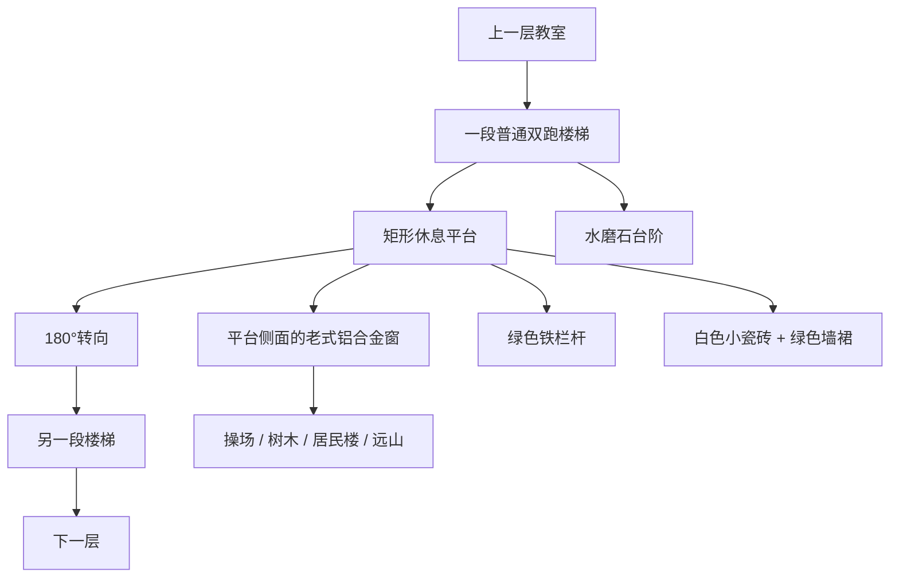
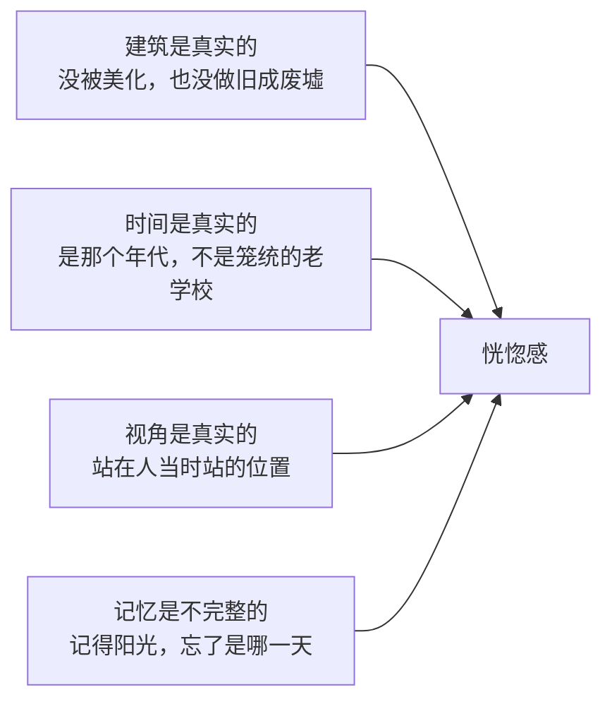
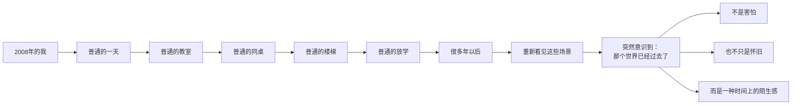

# 千禧年中国校园梦核的记忆研究

> 一个小学生的视角，重新观察2000年代中国校园中的建筑、日常、人际关系与时间感，探索为什么一些再普通不过的校园场景，在多年以后会产生类似的恍惚感。

***

***

> tags: [千禧年, 中国校园, 梦核, 童年记忆, 校园建筑, 2000年代, 视觉记忆, 时间感]

## 一、说的到底是哪种“梦核”

先说清楚：这里的“梦核”不是废弃学校、鬼屋、诡异走廊，也不是刻意去制造恐怖。

更像是这么一句话：

**“我明明记得这里，可是它已经不属于现在了。”**

千禧年前后，很多学校长得都差不多：

- 四到六层的教学楼
- 白色或浅色小瓷砖
- 绿色墙裙与绿色铁扶手
- 水磨石楼梯
- 老式铝合金窗
- 木质或铁架课桌
- 黑板与粉笔
- 吊扇、日光灯
- 操场、篮球架、居民楼
- 放学以后逐渐安静下来的楼梯

这些东西当时一点都不特别，有的我们还嫌它旧。

可很多年以后再看到，才反应过来：

**原来自己怀念的不是建筑。**

**而是那个曾经每天走过这座建筑的自己。**

## 二、那时候的我

时间大概是 2008 年前后。我是个普通的小学生，家里不算富裕，也不至于要为吃穿操心。每天早上背着书包去学校，上午上课，中午吃饭，下午继续写作业。

那时候学校就是生活本身的一部分。我不会研究楼梯是什么结构，也不会去想窗户是哪个年代的。我只会觉得：

> “怎么又要爬这么多层……”

五楼好高。楼梯好长。书包有点重。

老师刚布置的题还没写完，放学以后还得赶紧回家。

那时候我完全不知道，**这些看起来永远不会消失的日常，正在一点一点变成记忆。**

## 三、一个普通下午是怎么过去的

把那个下午摊开来看，它其实是一条很慢的斜坡。

```mermaid
flowchart LR
    A["下午上课<br/>教室里还有很多人"] --> B["同桌借笔<br/>一件再普通不过的小事"]
    B --> C["最后一节课<br/>阳光慢慢移动"]
    C --> D["放学铃响<br/>整个学校突然变得很吵"]
    D --> E["走下楼梯<br/>人越来越少"]
    E --> F["五楼窗边<br/>还能听见操场"]
    F --> G["走出校门<br/>回头看教学楼"]
    G --> H["天慢慢黑了<br/>学校重新安静下来"]

    style A fill:#f7f0df,stroke:#999
    style B fill:#f7f0df,stroke:#999
    style C fill:#f7f0df,stroke:#999
    style D fill:#f7e3b5,stroke:#999
    style E fill:#f3d49b,stroke:#999
    style F fill:#edc477,stroke:#999
    style G fill:#d9c29c,stroke:#999
    style H fill:#8c8c8c,color:#fff,stroke:#666
```

奇怪的地方在于：**学校并没有突然消失。**

只是声音越来越少，人越来越少，阳光越来越低。然后你就离开了。

### 同桌借笔

下午，我低着头写数学题。旁边的女同桌突然碰了我一下。

“借我一支笔。”

我打开铅笔盒，拿出一支递过去。她接过去说了声谢谢，然后继续写题。

就这么简单。

这事要是放在今天，根本不会有人觉得值得记下来。

可童年的记忆不按重要程度存档。留下来的，往往就是这种没什么意义的小事。

一支笔，一张课桌，半页没写完的数学题，旁边一个熟悉的人，窗外的阳光，以及当时完全不知道往后会怎样的自己。

---

我一直记得的，其实是这件事的**位置感**。

不是从教室后排望过去的一排后脑勺，而是坐在自己座位上、刚从题目里抬起头的那一瞬间。

她从旁边靠过来，伸手接笔。再往后一点，是别的同学、黑板、还没擦干净的板书。

这点差别其实很大。

> **“一个女孩在教室里借笔”是一张照片。**
>
> **“我坐在那里，她坐在我旁边”才是一段记忆。**

照片可以属于任何人。

记忆只属于当时坐在那个位置上的那个人。

### 放学后的楼梯

放学铃一响，楼梯里先是非常吵。书包、脚步、说话声混在一起，有人跑下楼，有人在喊同学，有人约着一起去小卖部。

可走了几层之后，人开始变少。

然后突然——安静了。

就在那几秒里，我第一次注意到一件平时根本不会想的事：

**原来学校这么大。**

为什么偏偏是楼梯？

要说的并不是“漂亮的楼梯”。恰恰相反，它越普通越好。千禧年那批校园楼梯，大多长这样：

它不是大厅，不是礼堂，也不是什么现代建筑。就是一座每天都要经过的楼梯。

**也正因为普通，它才最容易留下来。**

---

我记得的楼梯，永远是从转角那个位置看出去的。

不是从楼梯底下仰头看它有多高，也不是站在平台中央端详这栋楼。

就是走到转角，稍微停一下。

前面是下一段台阶，侧面一扇老式窗户，阳光落在水磨石上，窗外是操场、树，和远处的城市。

小时候我们不会“欣赏建筑”。我们只是走到这里，然后顺手看了一眼窗外。

### 五楼

有时候放学以后我没马上回家。也许是找同学，也许是拿东西，也许只是小孩子突然想往楼上走。

于是到了五楼。这里已经没什么人了，但下面的操场还有声音。

“砰。”

篮球落地。

“传过来！”

有人在喊。

我站在窗边，看不清他们是谁。他们变得很小，而窗外的世界变得很大——居民楼、树、道路、天空，还有远处的山。

那大概是我第一次隐约觉得：

> **“原来学校外面，还有这么大的世界。”**

当时不会给这种感觉起名字。很久以后才明白，那是童年第一次撞上“世界很大”这件事。

### 放学后的电脑室

还有一个特别千禧年的地方：电脑室。

一排排米白色的 CRT 显示器，厚厚的机身背后拖着电线，键盘、鼠标、耳机，一张张编号的桌子。

几十个孩子刚刚还坐在这里，现在全走了。电脑都关着，黑屏上映着窗户。

---

我站的位置大概在最后一排，或者干脆就在门口——不是老师巡视时的那个角度，也不是为了把机器看清楚。

就是一个小孩站在那儿，看着：

**“刚刚还有很多人的地方，现在突然空了。”**

电脑室本身并不恐怖。

真正让人恍惚的是那句：**人刚刚还在。**

### 从校门口回头

终于走到校门口，已经准备回家了。但走出去以后，人往往会下意识回头。

教学楼还在那里，操场还在那里，窗户一排一排地亮着。有几个同学还没走，门卫室亮着灯，风吹过操场。

然后你继续回家。

---

这一眼是从校门附近回头看的，视线很低——大概就是那时候的身高。教学楼不在眼前，而是隔着操场或者一片空地，远远地立在那里。

小时候看教学楼就是这种感觉：

**它很大。**

而自己很小。

### 天黑以前

如果把那天剩下的几个小时也列出来，大概是这样：

| 时间 | 学校里发生了什么 |
|------|------------------|
| 15:30 | 最后一节课，教室里还坐满人 |
| 16:20 | 放学铃，楼梯一下子挤起来 |
| 16:40 | 人群散去，教学楼开始安静 |
| 17:00 | 操场上还有孩子，楼梯已经没什么人 |
| 17:30 | 大部分人走了，教室陆续关灯 |
| 18:00 | 天色暗下来，只剩零星几扇窗亮着 |
| 18:30 | 校门关上，一天结束 |

这是一种很轻的消失。没有任何东西被搬走，只是一个个孩子离开了，一间间教室关灯了，一个个声音远去了。

最后学校还是那座学校，只是里面没有我们了。

## 四、为什么现在想起来像梦

这种感觉大概有四层，前三层都要是真的，最后一层反过来必须是残缺的：

### 建筑是真实的

它得像一所真正存在过的学校，没被美化过，也不是为了“梦核”刻意做旧成废墟。

### 时间是真实的

它身上得有明确的 2000 年代生活痕迹。不是泛泛的“老学校”，而是**那个年代的学校**。

### 视角是真实的

最要紧的其实不是建筑，而是：**小时候的我站在哪里？**

楼梯转角、教室座位、电脑室后排、五楼窗边、校门口——这些都是“人的位置”，不是取景的位置。

### 记忆是不完整的

真正的童年记忆不会像电影那样完整。

你记得阳光，记得楼梯，记得一个同学，记得某句话；却可能忘了具体是哪一天，忘了那个人的名字，甚至忘了那所学校后来变成了什么。

正是这些缺口，让它变成了梦。

## 五、我们真正怀念的是什么

这大概是整篇里我最想弄清楚的问题。

一开始我以为自己怀念的是**学校**。

后来发现不是。真正怀念的是：

那个每天都觉得时间很多的自己。

那个认为明天一定还会来到学校的自己。

那个觉得五楼很高、学校很大的自己。

那个可以因为同桌借一支笔，就和一个人建立一天的小小联系的自己。

那个放学以后走下楼梯，却完全不知道多年以后自己会在哪里的自己。

## 六、它不是恐怖，是时间错位

它特殊的地方，是一种很轻的时间错位。

它和常说的那种 Dreamcore，区别大概在这儿：

> **传统梦核让熟悉的地方变得陌生。**
>
> **千禧年校园梦核则让陌生的现在，重新变成熟悉的过去。**

## 七、最后：放学以后

如果让我重新成为那个小学生。

我可能还是会嫌楼梯太高。

还是会觉得数学题烦。

还是会因为老师拖堂而不高兴。

还是会嫌学校的电脑太慢。

甚至可能会抱怨：

“什么时候才能放学啊？”

然后铃声终于响了。

我背上书包。

走出教室。

穿过那条每天都走的走廊。

下楼。

经过三楼。

经过二楼。

经过一楼。

最后走出校门。

也许临走之前，我还会回头看一眼。

那时候的我不会知道：

**这一眼没有什么特别。**

可是很多年以后，再想起它的时候，我才发现——

那可能就是我和那个世界最后一次自然地告别。

没有告别仪式。

没有音乐。

没有人告诉我：

“你以后不会再回到这里了。”

只是某一天，我长大了。

而那个小学生还停留在记忆里的楼梯上。

阳光从窗户照进来。

操场上还有人在打篮球。

女同桌刚刚从我手里借走一支笔。

老师还在黑板上写题。

放学铃还没有响。

**一切都还没有结束。**

而我现在回头看的时候，

才发现：

**原来那就是最完整的童年。**

## 写在最后

> **“我怀念的不是那所学校，而是那个以为明天还会继续的小学生。”**