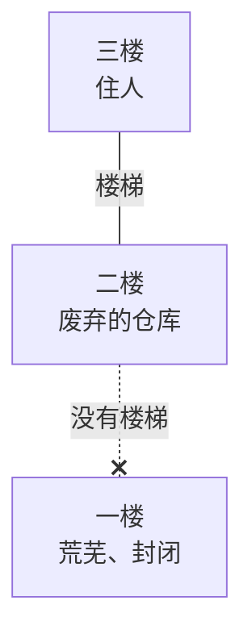
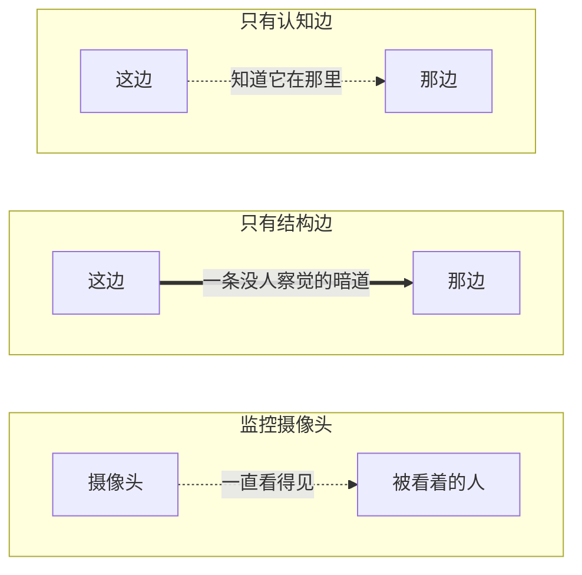
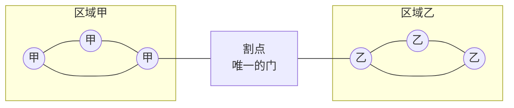
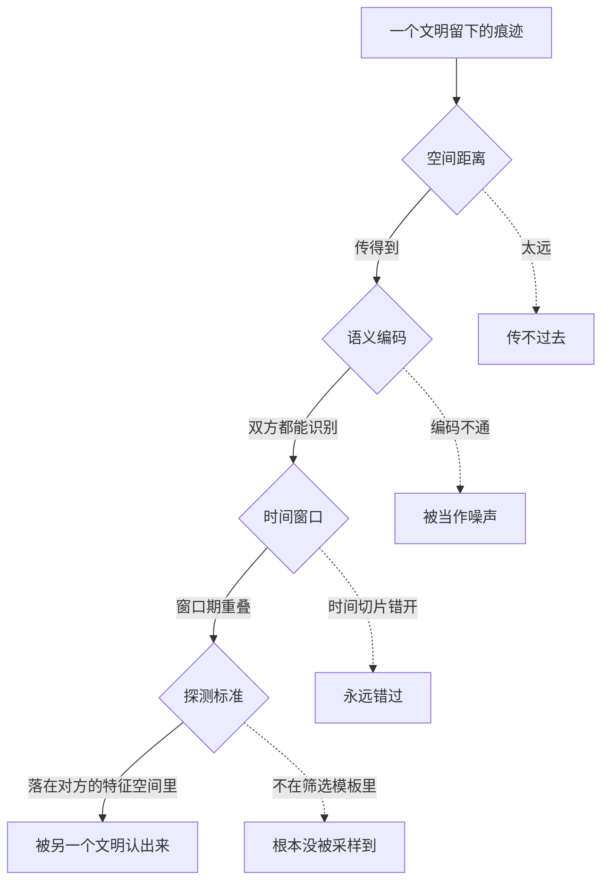

# 可达性拓扑：从一段楼梯到宇宙尺度的一次思维漫游

> 一段没有楼梯的二楼，为什么会让人感到安心，这个问题一路把我从一栋房子推到了宇宙的尽头  

***

***

> tags: [拓扑思维, 认知心理学, 图论, 费米悖论, 文明假说]  

## 引子：一个说不清的安心感

设想一栋三层的房子，三楼住人，二楼是废弃的仓库，一楼彻底荒芜。二楼到一楼之间没有楼梯，只有三楼到二楼这一条通道。

按理说，一楼的存在应该让人不安，它荒废、封闭、充满未知。但只要那段楼梯不存在，这种不安会被一种奇怪的平静盖过去。危险的对象明明还在那里，恐惧感却被悄悄调低了。

这件事让我卡了很久，一楼没有消失，威胁也没有减少，为什么心里会松一口气。

## 第一次转弯：距离不是重点，路径才是

一开始我以为这是距离带来的安全感，三楼够高，够远。但仔细想又不对，如果楼梯没断，哪怕一楼近在眼前，恐惧感反而会更弱，因为你随时能下去看一眼，掌握主动。反倒是楼梯断掉之后，那种说不清的忌惮才真正出现。

这说明重要的从来不是隔了多远，而是有没有一条路径能把危险带过来。人类对威胁的判断，很多时候不是用尺子量出来的，而是用一张图算出来的，节点之间有没有边，比节点之间隔多远更关键。

把那栋房子画成图，其实就只剩三个点和一条边：

一楼离三楼并不远，但中间那条边断了。

后来翻到环境心理学里的瞭望庇护理论，说的正是这个意思，人类真正追求的不是彻底封闭，而是看得见外面、外面却进不来的状态。庇护感的核心，是入侵路径被切断，而不是危险被消灭。

但这又带出一个新问题，如果安心感靠的是路径断开，那"知道一楼在那里"这件事本身算不算一种连接，如果算，它和真正能走过去的那种连接，是同一回事吗。

## 拆开来看：两种不该混为一谈的连接

想清楚之后，我发现这里其实藏着两种性质完全不同的边。

一种是结构边，指真实存在的可达路径，允许穿越、影响甚至入侵，那段楼梯本身就是。另一种是认知边，仅仅意味着我知道你在那里，我能感知你的变化，它可以是单向的，也完全不代表可达性。

这两种边彼此独立，可以只有认知边没有结构边，比如互相知道存在却无路可通的两个空间，也可以只有结构边没有认知边，比如一条谁都没察觉的暗道。监控摄像头是个很典型的例子，它不构成结构边，本身没法穿过来伤害人，却持续制造认知边，于是会出现一种分裂的体验，结构上安全，认知上却始终不安。

实线是能走过去的路，虚线只是知道对方在那里：

区分完这两种边，我又想到一个更棘手的情况，如果两个原本毫无关系的区域，只能靠一条路径相连，会发生什么。

## 唯一通道的代价

答案并不让人安心，这种单一连接节点在图论里叫桥，或者割点，它的特殊之处在于，一旦这个节点消失，两个区域会立刻退回互不可达的状态。

两团各自连得很密的区域，中间只挂着一个点：

把中间那个点拿掉，左右两边就再也没有关系了。

这也是为什么人类对唯一通道格外敏感，唯一的门、唯一的钥匙、唯一的联络人，安全感如果完全押注在一个脆弱的点上，风险会不成比例地集中在那里。

顺着这个思路，我一度觉得最优解应该是彻底不要这条通道，像楼梯那样直接断掉最省心。但这个结论很快就站不住了。

## 完全切断反而不是答案

因为彻底切断换来的是绝对的安心，代价却是完全的无知，你什么都看不见了。而历史上的城镇边界给出了另一种解法，城墙不是要隔绝一切，它留了城门，一个可以开关、可以盘查、可以随时关闭的口子。

这不是偷懒留缝，而是把完全阻断升级成了可切换的阻断，用有限的风险敞口，换取信息和主动权。想到这里我才意识到，真正让人安心的，往往不是隔绝本身，而是谁掌握着这条路径的开关，安全感的本质，是对可达性的所有权。

这套逻辑在一栋房子、一座城镇里都说得通，那如果把尺度硬拉到整个文明，甚至整个宇宙呢。

## 把尺度拉远：文明本身也是一张图

顺着这个念头往上推，人类文明可以看作一张图，节点是人类活动，边是活动留下的痕迹。地球是这张图的根节点，附近错综复杂地发散开来，一旦离开地球，连接迅速稀疏，离开太阳系，几乎荡然无存。

如果宇宙中真的存在别的文明，它们也各自有自己的图。两张图要产生联系，需要一个节点去架桥，我最初以为难点在于距离太远，信号传不过去。但认真推下去发现，距离甚至可能不是最难的一层。

## 架桥路上，比距离更难的三层

第一层是语义不兼容，架桥之前必须先有一套双方都能识别的编码方式，否则信号真的传过去，对方也只会当噪声处理。

第二层是时间窗口错位，而且我越想越觉得这层比空间距离更致命。一个文明能发出可探测信号的窗口期，在宇宙尺度上极其短暂，两张图即便空间上连通，也完全可能在时间切片上永远错过，这是一种时序意义上的不可达，哪怕静态拓扑本身允许连接。

第三层最让我意外，问题也许根本不在连不上，而在于对方从一开始就没有落进我们的探测标准里。我们拿碳基生命的模板去筛选整片天空，如果对方的存在方式完全不落在这套特征空间里，它就不是一个孤立节点，而是根本没被我们的采样算法捕捉到。

把这几层串起来，一个文明留下的痕迹要被另一个文明认出来，得先后过这几道关，任何一关没过都算没连上：

距离只是第一关，后面三关才是真正难的。

想到这里我忍不住往回问了一句，如果我们的识别标准本身就有偏差，那这个偏差是我们独有的，还是所有文明都逃不掉。

## 一个略微安慰的推论

答案可能是后者，不同文明的识别局限很可能会趋同，不是因为想法一致，而是因为都被同一套物理规律限制，光速有限，信息传递需要载体，这构成了一种约束驱动的收敛。换句话说，不是我们想得一样，是我们都被同一堵墙拦住了。

但这个推论安慰不了多久，因为它顺带揭开了一个更根本的问题。

## 最后落到的一句话：地图不是疆域

人类目前对宇宙的所有认知，本质上都是一种不断被更新的信念状态，而不是已经验证过的事实。每一次新的观测，只是在调整某种情况发生的概率，从未真正把某个假设钉死。

从一段没有楼梯的二楼出发，一路推到这里，我发现自己绕了很大一圈，其实只是在反复确认同一件事，认知和现实之间，永远隔着一层没法彻底消除的不确定性，而这层不确定性，可能是任何尺度的思考都躲不开的。

## 留下来的问题

- 渗流理论，讨论节点密度要达到多高，图才会从孤立小簇突变成全局连通
- 多层网络，边的类型可能不止一种，或许我们一直在错误的图层里搜索
- 自指问题，观测者本身也是图的一部分，永远没法从外部完整描述系统自身
- 分形自相似性，同一种连接困境，可能在完全不同的尺度上反复出现
- 动物园假说的图论翻译，沉默也许不是架不了桥，而是主动选择不激活边