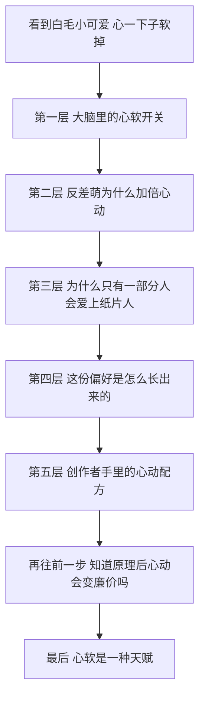
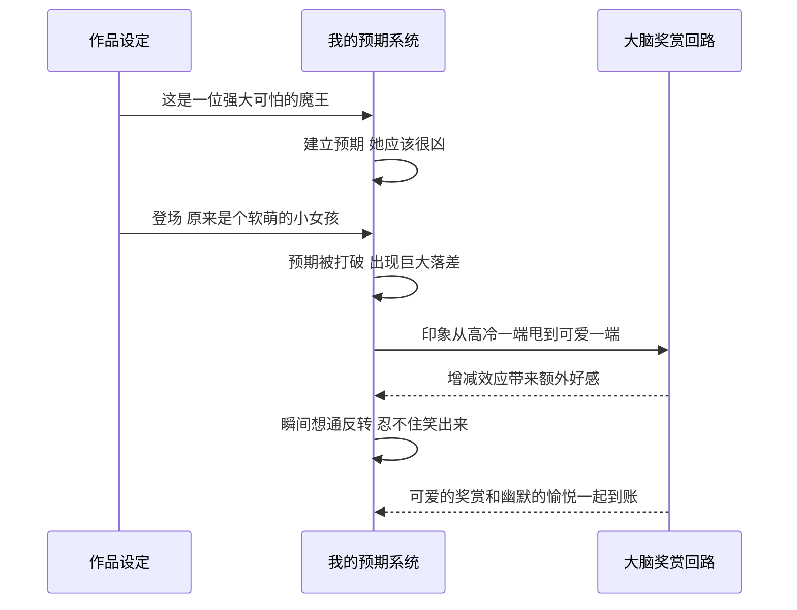
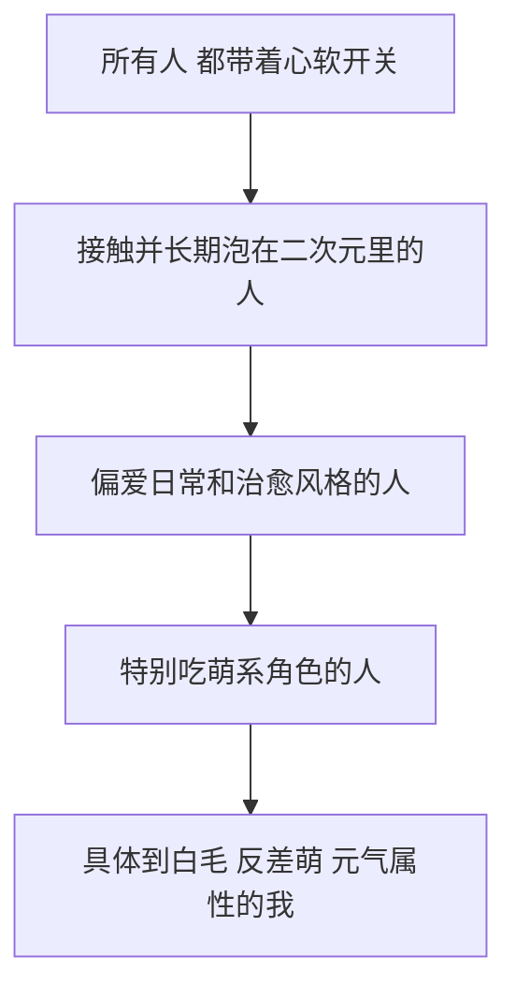
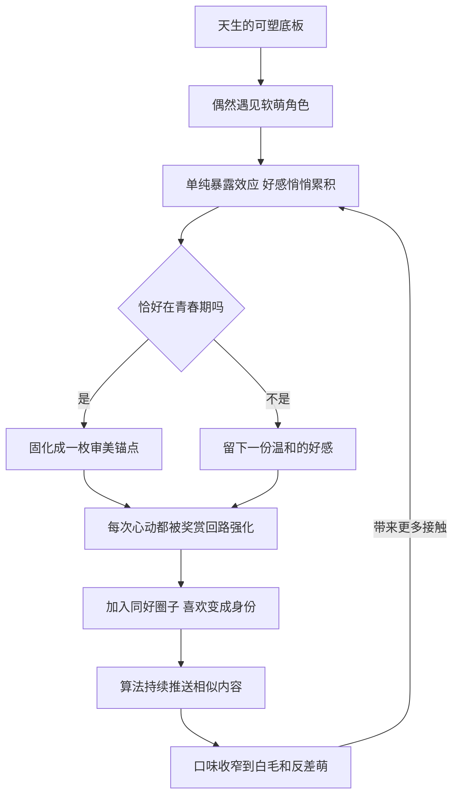
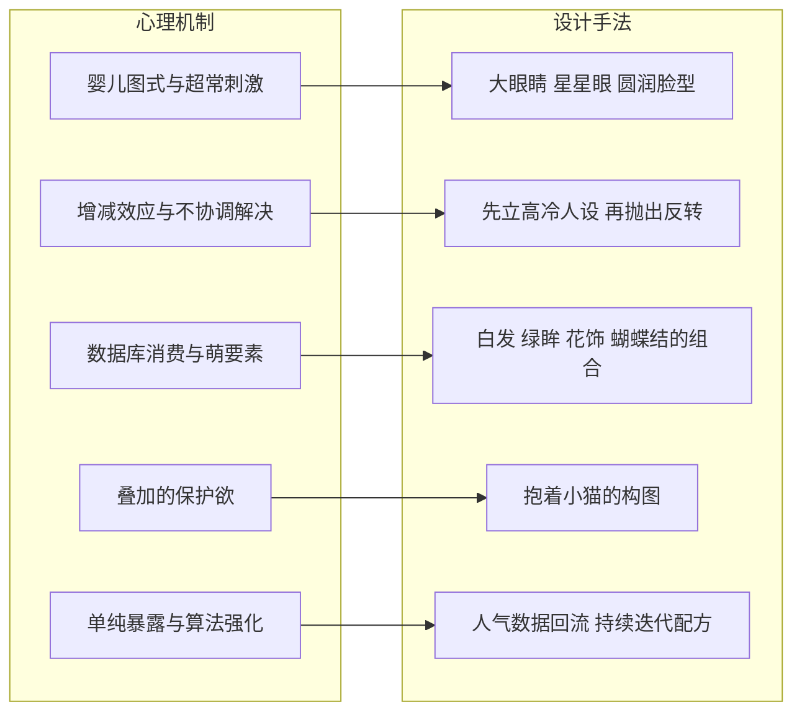
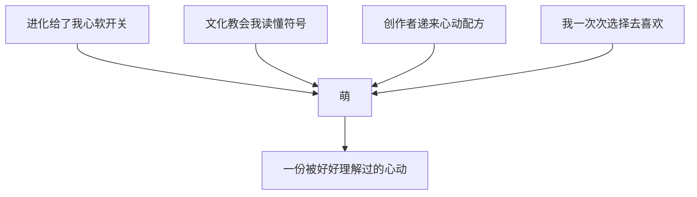

# 心软是一种天赋：我把「萌」一层层拆开之后看到的东西

> 我一直很喜欢白毛、软乎乎、还带一点反差的二次元小可爱，喜欢到开始好奇这份心动到底是从哪里冒出来的。于是我顺着这个问题一路往下挖，从大脑里的奖赏回路挖到创作者的设计图纸，最后挖到了一个比喜欢更大的东西呢。

***

***

> tags: [二次元, 萌文化, 反差萌, 审美心理学, 角色设计, 御宅文化研究]

## 写在前面：为什么突然想研究这个

先偷偷坦白一件事哦 (〃'▽'〃)

我是那种手机相册里塞满了可爱表情包的人，往下一划，一屏一屏全是软萌的小家伙。白毛的、呆毛翘起来的、抱着小动物的、鼓着腮帮子生闷气的，看到就走不动路。前阵子我存了一张琪露诺叼着冰棍的图，明明她自己就是冰之妖精，还要抱着雪糕啃得那么认真，我盯着看了好久好久，心都要化掉了的说 ≧▽≦

我也特别吃反差萌这一口。那部讲打了三百年史莱姆、不知不觉就练到满级的番里，魔王这个名字听起来那么吓人，我本来以为会是个威严的大boss，结果登场一看，是个超级可爱的小女孩，那一瞬间的落差让我想抱着枕头在床上打滚。还有《天使降临到我身边》里的姫坂乃愛，金色头发，表情丰富到截图就能凑成一整套表情包，打心底觉得自己是世界第一可爱，被打击了会马上蔫掉，过一会儿又活蹦乱跳地回来了，那个被大家反复截图的biu～名场面，我能循环一整个下午 (✿◡‿◡)

可是每次想跟别人聊这个，我心里都会先咯噔一下。喜欢萝莉这几个字说出口，总怕被人往奇怪的方向想。我自己心里很清楚，我喜欢的是纸片人身上那份被一笔一笔画出来的天真、元气和傲娇，那是一种很干净的心动。

正因为清楚，我才更想把它弄明白。与其每次都急着解释，不如干脆认认真真拆开来看看：这份心动到底从哪儿来，为什么偏偏会落在我身上，创作者又是怎么精准戳中我的。这一路拆下来，我整理成了下面这张小地图 ✧*。

呐，我们就从最底下那一层，慢慢往上爬吧 ٩(ˊᗜˋ*)و

## 第一层：大脑里藏着一个心软开关

先从最朴素的问题开始。为什么圆圆的、小小的东西，会让人一下子就想喊好可爱呢？

早在1943年，奥地利的动物行为学家洛伦茨就提出过一个概念，叫婴儿图式。他发现幼小生物的脸上普遍带着一组特征：脑袋相对身体很大，额头又高又圆，眼睛大大的而且位置偏低，鼻子和嘴巴小小的，脸颊肉嘟嘟，整个轮廓圆滚滚。这组特征就像一把钥匙，会自动打开成年个体心里的照顾欲和保护欲。人类的小宝宝身上有，小猫小狗身上也有，所以我们看到刚出生的小奶猫，和看到小婴儿时的那种心软，是同一把钥匙打开的同一扇门哦 (*´▽｀*)

光有概念还不够，后来的科学家真的跑去测了。2009年，Glocker和同事用图像处理把婴儿照片里的婴儿图式调高或者调低，再请成年人来打分。结果整齐得不得了：婴儿图式越明显，大家觉得越可爱，也越想去照顾这个宝宝。同一年，这个团队又用脑成像去看一群还没有生过孩子的女性，发现高婴儿图式的面孔会激活大脑里一个叫伏隔核的地方。伏隔核是奖赏回路的核心区域，我们吃到好吃的、收到喜欢的礼物时，它也会亮起来。

也就是说，好可爱这三个字，是大脑在给我们发小奖励呢。难怪看萌图的时候嘴角会忍不住往上翘，那是奖赏回路在偷偷放小烟花 ✧٩(ˊωˋ*)و✧

还有一个特别有意思的小现象。看到超级可爱的东西时，有时候会冒出一种好想捏捏、好想嗷一口的冲动，甚至会咬着牙说可爱到想揍一拳，网上管这个叫可爱侵略性。心理学家Aragón和同事在2015年认真研究过它，他们发现，当正面情绪强烈到快要溢出来的时候，人会冒出一点看起来相反的表达，帮自己把情绪拉回平衡。所以对着萌图咬牙切齿的时候，其实是在给自己的心软轻轻踩一脚刹车，完全不用担心啦 ＞ω＜

说到这里，二次元角色的小秘密就露出一角了。动漫里的萌系角色，眼睛比真人大得多，鼻子嘴巴简化到只剩几笔，脸型软乎乎，头身比也往幼态那边靠。这些全都是婴儿图式的特征，而且被放大到了现实里根本不会出现的程度。

这让我想起另一位动物行为学家丁伯根做过的经典观察。他发现有些鸟会放着自己真实的蛋不管，跑去孵研究者做的超大号假蛋，因为更大、更显眼的信号能更强烈地触发它们的本能。他把这种比天然刺激还夸张的东西叫作超常刺激。

萌系角色的画法，某种程度上就是给人类准备的超常刺激。它把心软开关需要的那些信号，一个一个调到了满格，所以一张小小的图，就能让人瞬间破防呢 (｡･ω･｡)ﾉ♡

## 第二层：反差萌为什么杀伤力会翻倍

如果说婴儿图式解释了可爱本身，那反差萌就是在可爱上面又补了一记暴击 ヽ(✿ﾟ▽ﾟ)ノ

我想了很久，为什么同样可爱的角色，带反差的那个总是更让人上头。答案藏在社会心理学的一个经典实验里。1965年，心理学家阿伦森和林德让被试在好几轮交流中不断偷听到另一个人对自己的评价。有的人听到的评价从头到尾都是好的，有的人听到的评价是先差后好。最后大家对那个人的喜欢程度，先差后好的那一组反而最高，超过了一直被夸的那一组。这个现象后来被叫作增减效应。

放到角色身上就特别好懂了。魔王这个身份，先在我心里立起了一个强大、可怕、离我很远的预期。等她真正出场，是个会害羞、会闹小脾气的小可爱，我对她的印象一下子从高冷的那一端被甩到了可爱的这一端。这一甩带来的落差，本身就是额外的心动。

乃愛是同一个道理，只是换了一种玩法。她自信满满地宣布自己是世界第一可爱，那副架势可足了，下一秒被一句话戳中就蔫成一小团，再下一秒又自己满血复活。自信和脆弱在她身上来回切换，每切换一次，我的心就被轻轻晃一下 (＾▽＾)

琪露诺就更犯规了。堂堂冰之妖精，天天把最强挂在嘴边，结果大家记住她的是那个笨笨的⑨，还有抱着雪糕认真舔的样子。强大的设定和呆萌的日常叠在一起，想不喜欢都难呢。

我还发现，反差萌常常会让人一边心软一边笑出声。这跟幽默心理学里的一个理论很像。心理学家Suls在1972年提出，笑点的产生分两步：大脑先建立一个预期，接着预期被打破，出现了不协调，然后我们在一瞬间想明白了这个不协调，豁然开朗的那一刻就会冒出愉悦。反差萌恰好把可爱带来的奖赏和想通反转带来的愉悦叠在了一起，两份快乐一起到账，杀伤力当然翻倍啦 (≧∇≦)ﾉ

我把这个过程画成了一张时序图，大脑里发生的事情大概是这样的。

## 第三层：大家都会心疼小孩子，为什么只有一部分人会爱上纸片人

写到这里，我自己给自己出了一道难题 (⊙_⊙)

如果萌的底层是照顾欲，那几乎每个人看到小朋友都会心软，都会想保护弱小，为什么真正会对二次元小萝莉着迷的，只是其中一部分人呢？这个问题想通之后，我才发现婴儿图式只是原材料，从原材料到我的喜欢，中间还隔着好几层滤网。

第一层滤网，是本能和文化的交界。日本的认知心理学家入户野宏专门研究可爱，他提出过一个两层模型。里面那一层，是一种想要靠近、想要亲近的温暖情绪，婴儿图式是能引发它的线索之一，但远远不是唯一的线索。外面那一层，是这份情绪在人群和文化里被怎么说、怎么用、怎么传播。他和同事后来的实验也发现，一些完全不带婴儿脸特征的可爱图片，同样能让人产生可爱的感受。

这就意味着，可爱的边界是可以被文化撑大的。二次元角色恰好站在这两层的交界处，它借用了婴儿图式的信号，又叠加了大量现实里根本不存在的东西：渐变的发色、会发光的瞳孔、猫耳、呆毛、傲娇的口癖。评论家东浩纪在《动物化的后现代》里观察到，很多御宅族看角色时，会把角色拆成一个个可以识别的萌要素来消费。可这些要素本身就是一门语言，得先在这套视觉语言里泡上很久，才读得懂它们在说什么。没接触过的人看到猫耳和呆毛，心里大概不会有任何波澜。

第二层滤网，是对象的性质完全不一样。这一点我觉得特别重要，所以想说得清清楚楚。现实里对小孩子的关心，连着的是守护、责任和整个社会的共同约定，那是每个人都应该有的东西。我对纸片人的喜欢，连着的是审美、情绪和爱好，它更像喜欢一首歌、收藏一套手办。两者借用了同一套心软的神经回路，走向的却是两扇完全不同的门。一扇门后面是真实的孩子，需要被好好保护；另一扇门后面是画出来的符号，承接的是我对美和温柔的想象。正因为我分得清这两扇门，这份喜欢才能一直干干净净的 (｡•̀ᴗ-)✧

第三层滤网，是每个人对可爱的敏感度本来就不一样。Sprengelmeyer和同事在2009年发现，人分辨可爱面孔的能力会受到激素水平这类生理因素影响，同样两张脸，有的人一眼就能看出哪张更可爱，有的人几乎看不出差别。这就像有的人对甜味特别敏感，有的人对旋律特别敏感，奖赏系统对不同刺激的反应强度，生来就有高有低。

第四层滤网，是一层一层收窄的圈子。

每往下走一层，人就少一些。这和美食爱好者里有人专挑川菜、有人独爱甜品是一模一样的分化，爱好越深，口味越细，是再正常不过的事啦 (๑•̀ㅂ•́)و✧

## 第四层：这份偏好，是怎么一点一点长出来的

滤网讲清楚了，新的问题又冒了出来。我的审美倾向是怎么来的？这些圈子又是怎么被我一步步选出来的？总不能是我一出生就指着屏幕说我要白毛吧 (⊙ω⊙)

我琢磨了好久，觉得更准确的说法是，人天生带着的是可塑性。刚出生的时候，我们拥有的只是一块对圆脸大眼很敏感的通用底板，它本身不指向任何具体的东西。至于这块底板最后被捏成什么形状，要看后来遇见了什么。

第一股在悄悄捏它的力量，叫单纯暴露效应。心理学家扎荣茨在1968年发现，一个东西只要反复出现在眼前，哪怕我们根本没有认真想过它，好感也会自己慢慢往上涨。他做过一个很可爱的实验，给一群完全不懂中文的人看汉字，再让他们猜每个字表达的是好意思还是坏意思。结果看过次数越多的字，大家越倾向于猜它是好意思。

所以当我一次又一次在推荐页、表情包群、同好的头像里看到那些软萌角色时，好感早就在一点一点攒着了，那时候我甚至还没意识到自己喜欢呢 (。・ω・。)

第二股力量，是青春期留下的锚点。音乐心理学里有个很成熟的发现，叫怀旧高峰。2013年，Krumhansl和Zupnick研究人们对流行音乐的记忆和偏好，发现人一辈子最深、最持久的喜好，大多是在青春期到成年早期形成的，而且还会像瀑布一样一层层往下传，连父母年轻时听的歌，都会在孩子身上留下一个小小的高峰。

这个阶段的人正在拼命搞清楚我是谁，情绪体验又浓又烈，大脑把情绪和记忆绑在一起的效率也格外高。这个规律最早是在音乐里被发现的，可我觉得放到看番上一样说得通。十几岁时狠狠心动过的那个角色，会变成一枚锚，之后遇到的每一个新角色，都会被悄悄拿去跟它比一比，越像，心就越容易软。

第三股力量，是一次又一次的奖赏强化。每一回看番带来的放松，每一张萌图带来的小雀跃，都会把这类角色和好开心之间的连接再加固一点。偏好就是这样被喂大的，一口一口，日复一日。

第四股力量，是圈子给的归属感。社会心理学家泰弗尔和特纳提出的社会认同理论讲过，人会从自己所属的群体里获得一部分自我价值。当我和同好一起舔屏、一起玩梗、一起为同一个角色尖叫的时候，这份喜欢就从我觉得她好看，升级成了这就是我呀，变成了身份的一部分，想甩都甩不掉呢 (*≧ω≦)

第五股力量，是这个时代特有的加速器，推荐算法。我点开过什么、停留了多久、给什么点过赞，平台全都记着，然后源源不断地推来更相似的内容。原本需要很多年才会自然发生的口味收窄，被算法压缩到了几个月甚至几周，泛泛的喜欢二次元，很快就被打磨成就是喜欢白毛反差萌这种细到发丝的偏好。

这五股力量不是排着队依次出场的，它们首尾相连，绕成了一个越滚越大的雪球。

盯着这张图看了一会儿，我终于明白为什么总觉得这份喜欢好像一直都在。它确实在很早很早以前就埋下了种子，只是后来的每一天都在被浇水、被晒太阳，才长成了现在这么茂盛的样子 ☆⌒(ゝ。∂)

## 第五层：创作者手里的那张心动配方

前面四层，都是从我这个观众的位置往里看。现在我想换个位置，站到画师和编剧那一边，看看他们是怎么把这些机制反过来当成设计工具的。

我拿一张自己特别喜欢的图来当例子。图里是一个白发的小可爱，头发软软地垂下来，别着一朵小白花，两边系着绿色的蝴蝶结，一双绿色的大眼睛亮晶晶的，脸颊晕着淡淡的粉，怀里抱着一只小白猫，小猫刚好挡住了她的半张小脸，背后是一扇洒满柔光的窗。第一眼看到我就呜哇了一声，后来一层层拆开，才发现每一个细节都不是随手画上去的。

先看视觉参数。大眼睛、极简的五官、圆润的脸型，就是前面说的超常刺激，把婴儿图式的每个信号都推到了满格。瞳孔里的高光也很关键，画师们常把这种画法叫作星星眼，亮点让眼睛看起来湿润又有神，大脑读到的是真诚和敞开。再加上微微低着头、把小猫抱在脸前的姿势，在人和人的相处里，这种收拢身体的小动作通常会被读成没有攻击性，看的人不知不觉就卸下了防备。

再看发色。日系作品里的发色，早就形成了一套心照不宣的符号。白发和银发常常用来标记不太属于日常的身份，精灵、神明、转生者、身怀秘密的人，它自带一层梦幻的滤镜；在一堆黑发棕发里，白色又特别抓眼，角色一出场就能被记住。这张图把白发和绿眸、柔光、花朵放在一起，整体在说的是安静、纯净、治愈。观众还没读到任何性格设定，心里就已经给她贴好了温柔的标签。

然后是萌要素的组装。前面提到东浩纪说的数据库消费，站在创作者这边看，就是一份现成的要素菜单。发色、瞳色、发型、配饰、小动物伙伴、性格类型、口癖，设计角色有点像点菜，挑出几样被验证过的要素，组合出一张新面孔。拿这张图拆一下，白发、绿眸、花饰、蝴蝶结、小猫伙伴、害羞的姿态，每一样都是菜单上的熟面孔，叠在一起算的是乘法。

接着是反差的写法。反差萌在商业创作里很少是碰巧出现的。编剧会先借旁白、借其他角色的议论、借身份设定，把强大、危险、高冷的预期立得稳稳的，再挑一个最合适的时间点，抛出笨拙、害羞、对小动物超级温柔的那一面。先扬后抑的节奏卡得越准，增减效应的落差就越大。

还有道具和伙伴。怀里那只小白猫可不是背景装饰哦。它自己就能独立触发一次心软开关，和角色本身的可爱叠在一起；同时抱着比自己更小的生命这个动作，又在悄悄告诉观众，这个角色很温柔、很会照顾别人。于是我对小猫的怜爱和对她的怜爱互相放大。花朵和蝴蝶结也是同样的思路，再给整体加一层柔软、自然、没有攻击性的暗示。画面里所有元素说的都是同一句话，没有一个在打架 ( •̀ ω •́ )✧

最后是市场的反馈。现在的角色设计，越来越不只靠画师一个人的直觉了。人气投票、二创热度、周边销量，都会回流到下一次设计里。观众这边有推荐算法在收窄口味，产业那边有数据在迭代配方，两边互相喂养，萌系角色就被打磨得越来越精准。

我把心理机制和设计手法一一对上，画成了下面这张对照图。

拆完这一层，我有一种很奇妙的感觉。创作者做的事，就像是捡起我们前面拆出来的每一块小零件，逆向拼出了一张心动的图纸。

## 再往前走一步：知道了原理，心动会不会变廉价呀

拆到这里，我心里又咯噔了一下 (｡•́︿•̀｡)

既然眼睛画多大、发色怎么选、反差什么时候抛出来，全都算得明明白白，那我对着萌图心软的那一瞬间，岂不是被人拿捏得死死的？这份喜欢，会不会一下子变得很廉价？

我纠结了好一阵子，后来想到了彩虹。我们早就知道彩虹是阳光在小水滴里折射和反射出来的，可雨停之后抬头看见它，还是会忍不住哇出声。物理学家费曼也聊过类似的事。他有位画家朋友觉得，科学家把一朵花拆成细胞和化学反应，就看不见它的美了。费曼却说，他能看到的美一点也不比朋友少，知道得越多，反而多出了一层又一层新的美。

萌也是这样的。知道了心软开关藏在哪里，我反而更珍惜每一次被按下的感觉了。

我还想明白了一件更有意思的事。这张配方，单靠创作者是做不出心动的。婴儿图式要有人天生带着开关，萌要素要有人在圈子里学会解读，反差要有人愿意先相信那个高冷的设定，算法要有人一次次点开。创作者递过来一把钥匙，我这边刚好长着一把锁，而锁芯的形状，是我自己这么多年一点点磨出来的。所以萌从来不是单方面的拿捏，它更像一场温柔的共谋，进化、文化、创作者和我，谁都少不了 (っ´▽`)っ

## 最后的最后：心软，是一种天赋

一路拆到这里，我想再往上走一步，走到比我为什么喜欢白毛小可爱更大一点的地方去看看。

一千多年前，日本平安时代的清少纳言在《枕草子》里专门写过一段可爱的东西。她写画在瓜上的小娃娃脸，写听到有人学老鼠叫就一蹦一跳凑过来的小麻雀，写两三岁的小娃娃爬着爬着捡起一粒小小的灰尘，一本正经地捏给大人看。然后她轻轻落下一句：不管是什么，只要是小小的，就都很可爱。那时候没有婴儿图式这个词，没有人知道伏隔核，更没有二次元，可人心软下来的那一瞬间，和今天刷到萌图的我，好像一点都没有变 (´｡• ᵕ •｡`)

进化最初给我们装上心软开关，目的很朴素，就是让脆弱的幼崽能够活下来。可人类做了一件很了不起的事，把这个为了生存准备的开关，一路延伸到了小猫小狗、毛绒玩偶、圆滚滚的手写字，最后延伸到了一笔一笔画出来的纸片人身上。这些东西大多数对生存没有任何帮助，我们却愿意为它们心软，为它们花时间，为它们创造出一整套精致的审美语言。

我越想越觉得，萌大概是人类在活下去这件事之外，多出来的那一点点柔软。一个文明强不强，可以看它能造出多坚硬的东西；可一个文明温不温柔，也许要看它愿意把多少心软，花在这些没有用的小可爱身上。

纸片人不会回应我，不会知道我存了她多少张图，也不会因为我的喜欢给我任何回报。可正是这种不求回报的喜欢，在现实里显得格外珍贵。每一次对着屏幕小声说出好可爱，都像是在悄悄练习一件事：在这个有点累、有点硬邦邦的世界里，保持心软的能力。

也正因为我把这一层层都看明白了，我更清楚这份心软该放在哪里。放在画出来的角色身上，它是审美，是治愈，是一场安全又干净的心动；面对真实世界里那些真正弱小的生命，同一个开关打开的是另一扇门，门后面写着守护和责任。同一份天赋，两种温柔，我都想好好珍惜。

所以现在，如果再有人问我为什么会喜欢那些白毛的、软萌的、带点反差的小可爱，我大概不会再慌慌张张地解释了。我会笑着告诉对方：因为心软是一种天赋呀，而我很幸运，一直都没有把它弄丢 (*/ω＼*)♡

## 悄悄留下的参考资料

- 洛伦茨的婴儿图式概念，1943年提出，近年的回顾可以看 [Lorenz's classic baby schema: a useful biological concept?](https://royalsocietypublishing.org/rspb/article/291/2025/20240570/104592/Lorenz-s-classic-baby-schema-a-useful-biological)
- Glocker等人2009年发表在Ethology上的 [Baby Schema in Infant Faces Induces Cuteness Perception and Motivation for Caretaking in Adults](https://onlinelibrary.wiley.com/doi/abs/10.1111/j.1439-0310.2008.01603.x)
- Glocker等人2009年发表在PNAS上的 [Baby schema modulates the brain reward system in nulliparous women](https://www.pnas.org/doi/10.1073/pnas.0811620106)
- Aragón等人2015年关于可爱引发二态表达的研究，发表在Psychological Science
- 丁伯根关于超常刺激的动物行为学观察
- Aronson与Linder在1965年关于增减效应的实验，日文科普可以看 [ギャップ萌えはなぜ起こる？ゲイン・ロス効果で紐解く](https://note.com/oh1ta/n/n58e59d27d1d0)
- Suls在1972年提出的幽默不协调解决两阶段模型
- 入户野宏的 [The two-layer model of kawaii](https://www.researchgate.net/publication/301329011_The_two-layer_model_of_'kawaii'_A_behavioural_science_framework_for_understanding_kawaii_and_cuteness)，以及和Ihara合作的 [Psychophysiological Responses to Kawaii Pictures With or Without Baby Schema](https://journals.sagepub.com/doi/10.1177/2158244017709321)
- Sprengelmeyer等人2009年关于激素与可爱敏感度的研究，发表在Psychological Science
- 东浩纪《动物化的后现代》与 [数据库消费](https://ja.wikipedia.org/wiki/%E3%83%87%E3%83%BC%E3%82%BF%E3%83%99%E3%83%BC%E3%82%B9%E6%B6%88%E8%B2%BB)
- Zajonc在1968年提出的 [单纯暴露效应](https://en.wikipedia.org/wiki/Mere-exposure_effect)
- Krumhansl与Zupnick在2013年发表的 [Cascading Reminiscence Bumps in Popular Music](https://doi.org/10.1177/0956797613486486)
- 泰弗尔与特纳的社会认同理论
- 日文圈对发色符号的整理 [Hair Color in Japanese Media](https://tvtropes.org/pmwiki/pmwiki.php/UsefulNotes/HairColorInJapaneseMedia) 与 [萌え属性](https://www.japanesewithanime.com/2017/11/moe-zokusei.html)
- 清少纳言《枕草子》中可爱之物的那一段
- 《天使降临到我身边》官方对姫坂乃愛的 [角色介绍](https://x.com/watatentv/status/1052515566160728065)