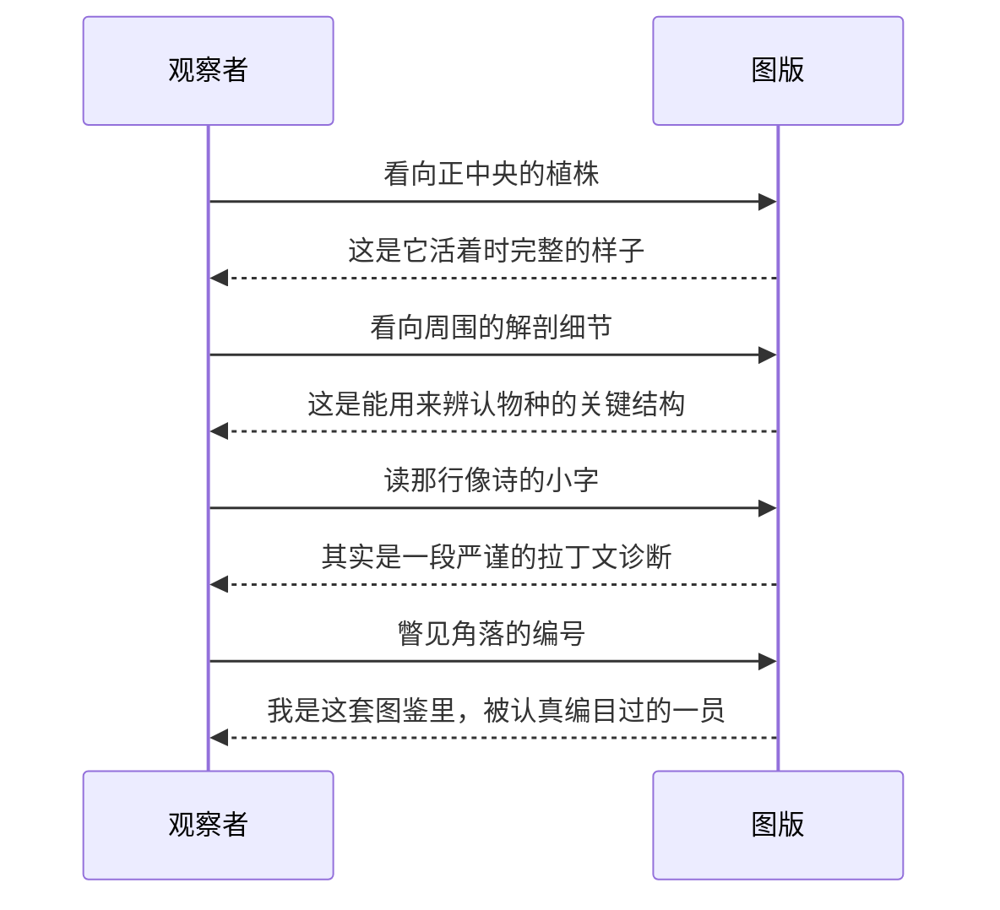
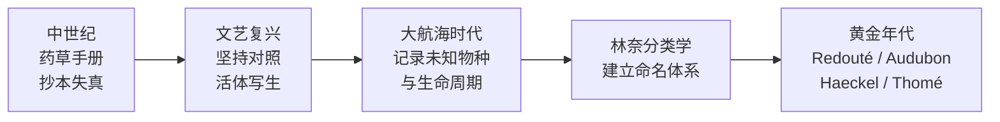
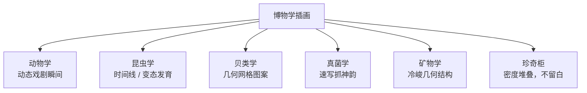
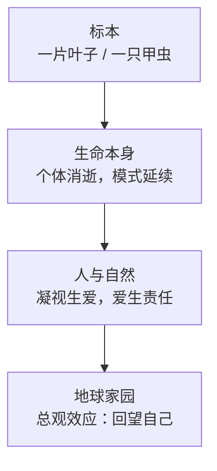
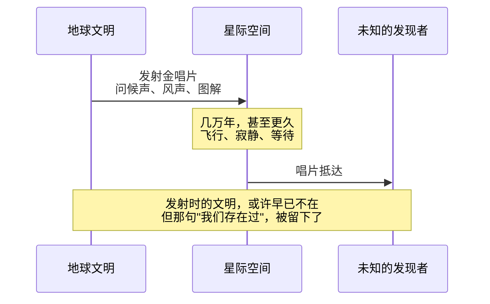
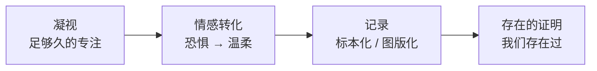

# 标本之心：论凝视、消逝与存在的证明

> 这是一次关于凝视的记录。它从一张两百年前的植物插画开始，一路走过一片叶子、一只甲虫，走到了整颗星球和满天繁星，最后又绕回到我们自己身上。写下来，是想留住这一路思考被一层层打开时的那种感觉。

***

***

> tags: [复古博物学插画, 博物学美学, 标本美学, 自然观察, 视觉设计灵感, 生命与消逝]

## 起点，只是一次很随意的好奇

那天早上醒得挺早，脑子还没完全清醒，就冒出一个念头：想给自己找一种新的审美方向。不是什么大计划，就是很单纯地，想换一双眼睛看看东西。不知道为什么，脑子里跳出来的第一个词，是复古博物学插画。

说实话，我当时对它几乎一无所知，只记得偶尔在某本笔记本封面或者某个咖啡馆墙上见过——泛黄的纸，细细的线条，一朵花旁边写着一串看不懂的拉丁文。我觉得它很优雅，可又说不清优雅在哪，就想干脆认真研究一下，一步一步来，别急。

## 一张图里的秘密

我找了一张百合的图版当作起点。乍一看，就是一幅很精致的花卉写生，可越看越觉得不对劲——它根本不是为了好看而画的。

图的正中间是完整的植株，旁边围着一圈拆开的细节：鳞茎、拆散的花朵、花药、雌蕊，每一样都单独标了字母。角落里还有一行小字，看起来像诗，其实是一段很严谨的植物学描述。我忽然意识到，这根本不是一幅画，是一份带插图的诊断书——每一根线条都有它的用处，要么是为了辨认这个物种，要么是为了让人一眼记住它的样子。这种"美丽是精确的副产品"的逻辑，是我第一次真正被这种风格打动的地方。

## 从药草手册，走到黄金年代

再往前追，这条脉络比我想象的长得多。最早的植物插图其实很潦草，是一代代抄手互相照抄出来的药草手册，很多花草已经完全走了样，因为画它是为了配药，不是为了观察。真正的转折发生在文艺复兴——有人开始坚持必须对着活的植物画，这一步看似简单，却是从"抄书"变成"科学"的分水岭。

再往后是大航海时代，欧洲人不断从没去过的地方带回从没见过的东西，逼着画家发明新的记录方式：有人记录昆虫从幼虫到成虫的全过程，有人画下从没被画过的鸟类。等到分类学被系统建立起来，插画就正式和"给一个物种上户口"这件事绑在了一起，一路走到十八九世纪的黄金年代——有人专攻百合和玫瑰，画得柔美如肖像；有人画鸟，充满戏剧张力；还有人画放射虫、水母，画得近乎几何图案，后来直接影响了整整一代装饰艺术。有意思的是，同一个时期，东亚也有一条完全独立发展出来的类似传统，只是走的是水墨的路子，谁也没借鉴谁，却殊途同归。

## 我开始不满足于"怎么做"

了解到这一步，我很自然地想到——那我能不能把这种感觉，用到自己想做的东西上？脑子里冒出一堆具体的念头：留白怎么留，字体怎么配，颜色怎么调，甚至想好了要做深色调的版本。

可是把这些想法一条条列出来之后，我忽然觉得有点空。那种感觉就像看着一份说明书，条理清楚，却完全摸不到它为什么会打动我。我意识到自己搞反了顺序——还没真正理解这份优雅从哪儿来，就急着把它拆解成可以复制的规则。我想先停下来，去感受，而不是去执行。

## 手里那片叶子

正好桌上就有一片捡回来的树叶，是那种典型的秋天颜色，黄里带着一点没退干净的绿。我举起来对着光看了很久，看清楚了那些细密交错的脉络，一层叠一层，像某种很安静的网。

看着看着，脑子里冒出一个念头，跟落叶有关——它会枯，会飘落，可它也会归到土里，去滋养明年新长出来的芽。那一刻我忽然明白了一件事：博物画家画一株植物，是想让它的样子活得比它本身更久；而一片叶子腐烂归土，是让它的生命本身活得比它的形态更久。方式不一样，可内核是同一件事——没有什么真的会被彻底抹去，只是换了一种存在方式。

## 一场没有人看见的森林

那种感觉一旦被打开，就很难再关上。我开始想象自己真的走进了一片秋天的树林——阳光斜切过树冠，把整片山野染成深浅不一的碎金，绿色还没退干净，黄色已经等不及涌上来。风很轻，鸟叫声断断续续，脚下的落叶堆得很厚，踩上去又软又陷。

我想象自己一直往林子深处走，撞见了一间早就没人住的小木屋。窗台积着灰，玻璃罐里还封着谁很多年前采集、压平、编号好的标本。桌上摊着一幅没画完的图——一片枫叶，叶脉才勾了一半，水彩只上了左边，右边还是素白的纸，拉丁文的名字写到一半就断掉了，墨迹晕开一点，像是笔尖在那里停顿了太久。那幅画停在了"最想画清楚"和"还没画完"中间的那个瞬间——跟我手里那片叶子，其实是同一种状态。

## 为什么这份克制，会被叫做优雅

想到这里，我忍不住去追问一个更底层的问题：我们为什么会觉得这种画面优雅？后来发现，答案其实藏在这个词本身里——"优雅"的词根，最早的意思是"精心挑选出来的"。博物插画正是一场极端的选择：画家面对一株真实、混乱、长满瑕疵的植物，决定哪根线值得留下，哪个角度最能说明问题，最后留在纸上的每一笔，都是被挑出来的。

除此之外，还有好几层原因叠在一起：人对清晰可辨的复杂结构天生有好感，自然界的形态本来就带着数学上讨喜的秩序，插画只是把它擦干净、显出来；一张手工晕染的图版背后是几十个小时的耐心，这种投入是能被看出来的，会让人心生敬意；把杂乱的自然编号、命名、归档，这个过程本身能满足人分类的本能；而放在今天这个到处都在抢夺注意力的视觉环境里，这种安静和克制，显得格外稀有和珍贵。这几层加在一起，大概就是"优雅"这两个字真正的重量。

## 原来不止是植物

理解到这一步，我才意识到博物学插画从来不只关于植物，它的野心大得多，几乎想把整个自然世界都收进画册里，只是不同的观察对象，逼出了完全不同的构图逻辑。

动物会动，所以画鸟的人追求的是扑翅、捕猎那样戏剧性的瞬间；昆虫会经历完整的变态发育，所以插画常常把卵、幼虫、蛹、成虫画在同一张纸上，讲的是一段时间，而不是一个切片；贝壳天生就是几何图案，于是插画走向了密集的网格排列，甚至直接影响了后来洛可可风格里的贝壳纹装饰；蘑菇腐烂得太快，画家必须几个小时内画完，逼出了一种更快、更抓神韵的笔法；矿物没有生命可言，画风也随之变得几何而冷峻。再往外延伸，还有一种完全相反的路子——把贝壳、昆虫、爬行动物、植物全部挤在同一页上，密密麻麻，毫不留白，是今天很多"珍奇柜"风格设计真正的源头。这些分支放在一起看，规律很清楚：视觉语言从来不是凭空定下来的，它是被观察对象本身的脾气逼出来的。

## 甲虫，还有那份说不出口的害怕

这么多分支里，我最喜欢的是昆虫那一支，可能是因为它藏着一种很特别的情感转折。十八世纪的哲学讨论里，有一组概念我觉得特别贴切：一种叫优美，指的是和谐讨喜、让人放松的美；另一种叫崇高，指的是面对某种超出理解能力的浩瀚时，恐惧和愉悦混在一起的那种战栗感。

博物插画做的事，其实就是把崇高一点点压缩成优美——把一个陌生、庞大、令人不安的存在，缩小到手掌那么大，画在干净的纸上，配好名字，装订进一本书里，恐惧就变成了可以捧在手心的喜爱。昆虫是这台转化机器运转得最剧烈的地方，因为多足、复眼、外骨骼这些特征，天生就比花朵更容易让人本能地排斥。可一旦真的凑近去看——看清楚蝴蝶翅膀的颜色其实是微观结构拆解光线拆出来的，看清楚一只复眼是成千上万个小眼拼出来的马赛克——那种震撼很快会压过最初的不适

不过我也提醒自己别把这份情感想得太干净，那个年代的标本采集，跟殖民扩张几乎是同一件事的两面，敬畏自然这份心情里，多少也混着占有和征服的成分。

## 从一片叶子，到一整颗星球

想清楚这层转化之后，我忍不住把这个逻辑继续往外推——推到生命本身，推到人和自然的关系，最后推到整颗地球。

一片叶子会腐烂，可它的脉络排列方式已经在这个物种身上重复了几百万年，还会继续重复下去，个体会死，模式却活得比任何个体都久。这份认识往前一步，就到了人和自然的关系——曾经有一位博物学家不满足于把植物一株株分开研究，坚持要看它跟土壤、气候、其他生物之间的关系，第一次提出自然是一张互相连接的网。这条路径很清楚：先是有人愿意花几个小时凝视一片叶子，凝视久了生出爱，爱一片叶子，自然会想保护它所依附的整片森林——这大概就是人类现代环保意识最早的起点。最后一步，是人类真的把这套凝视用到了整个地球身上：宇航员在绕月轨道上第一次看到地球从地平线升起的那一刻，很多人形容那种感觉是一种压倒性的领悟——这颗星球是一个整体，边界都是假的，而且小得让人心疼。只是这一次，观察者没法退到安全距离之外，我们既是那个举着画笔的人，也是画纸上被画的标本。

## 星尘，还有那句"我们存在过"

再往深处想，连地球本身都不是真正的起点。组成一片叶子、一颗心脏、一整颗星球的每一个原子，都是很久很久以前，某颗恒星死亡那一刻的一场爆炸炼出来的。人类抬头望向星辰，想要挣脱地球的束缚，某种意义上不是在逃离家乡，更像是想家——想回到那个真正诞生了我们的地方，只是它太古老，古老到我们只能远远张望。

而地球本身也有终点，很久很久以后，太阳会把它吞掉，那时组成我们的原子会重新打散，飘回宇宙深处，说不定哪天又被卷进一颗新生的恒星，变成别的什么东西的一部分。没有什么会被真正抹除，只是被拆开，重新排列。人类做过一件很像这件事的事——曾经有一艘探测器带着一张唱片飞进了星际空间，上面刻着地球上几十种语言的问候、风声、雷声，还有一些图解，飞得很慢很慢，等到有一天真的被谁捡到，发射它的文明大概早就不在了。这大概是人类给自己做的最后一张标本图版——把整个文明缩到一张唱片那么小，送进那片我们一直凝视、一直敬畏的浩瀚里，只为了说一句，我们存在过。

## 原来一架飞机，也可以是一份标本

绕了这么大一圈回来，我忽然想到一个很实际的问题：这套语法是不是只属于自然界？后来发现完全不是。工业革命之后，飞机、轮船、大楼这些机器变得像生物一样复杂，工程师直接搬用了博物画家的那套语法——把外壳解剖打开，露出内部结构，用字母标注每个零件，配上说明文字。二十世纪那些经典的飞机剖视图、邮轮结构图，用的其实是同一套视觉逻辑，只是标本从鳞茎变成了发动机。

我一度以为这跟某种哲学上的唯物主义有关，后来想明白，不对，没有变的从来不是物质，是姿态——那种想把复杂的东西拆开、看透、认真记录下来的冲动，两百年前对着一株百合是这样，今天对着一台机器也是这样。对象换了，年代换了，但那份"我想认真看懂你"的心情，从来没变过。

## 标本之心

写到这里，我大概明白了自己这一路真正在追问的是什么——从头到尾，其实都不是在研究一种画风，那只是一扇门。真正一直在场的，是凝视本身会转化情感这件事：看得够久，恐惧会松动，陌生会变成爱惜，甚至变成责任感，不管对象是一朵花、一只甲虫，还是整颗回头看向自己的星球。而记录，是对抗这份消逝的姿态——明知道眼前的东西终将枯萎、腐烂、消失，还是要留下一点什么，去证明它存在过，也被人认真看过。

所以，标本之心，说的其实是这个：用凝视去爱一样必将消逝的东西，再用记录，为这份爱和这份存在，留下一点不会被时间彻底抹掉的证据。这大概会是我以后设计任何东西时，都想留住的那颗心。