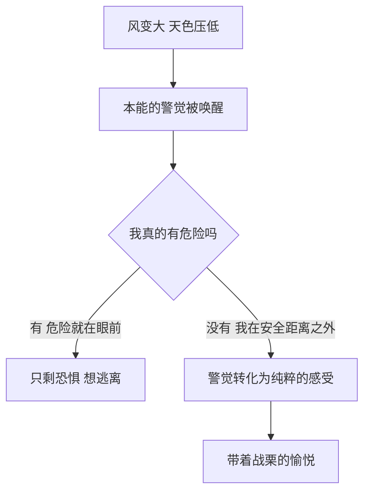
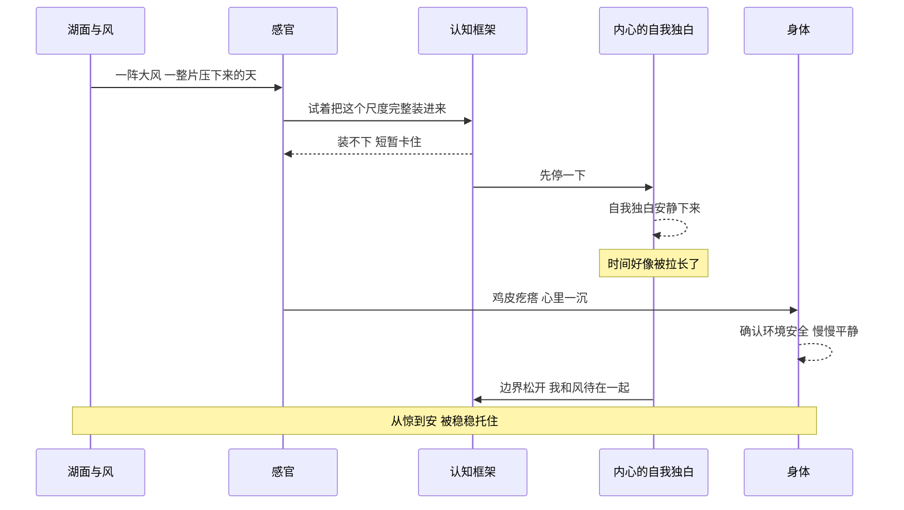
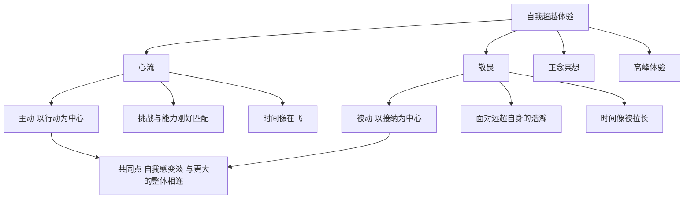
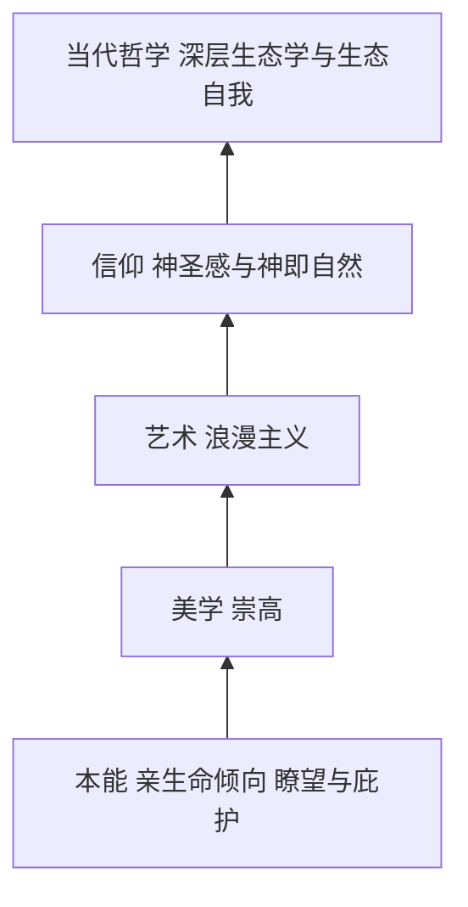
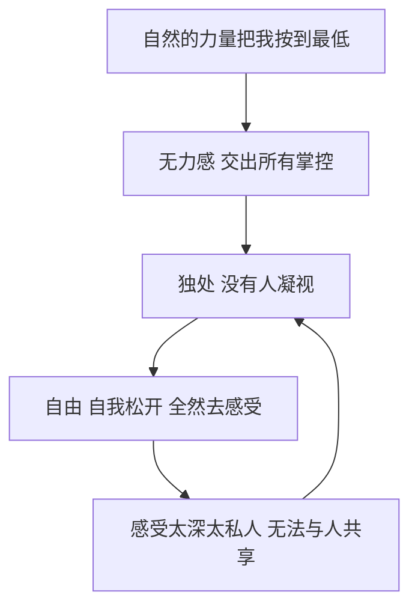
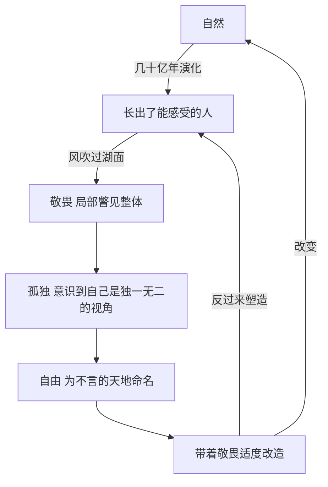

# 风满楼时，渺小也是一种荣耀

> 一个起风的阴天，我坐在湖边，被一阵风按住了几秒。我顺着那几秒一路追问下去，从身体里的本能走到美学、信仰和演化，最后发现震撼、孤独和自由，原来是同一件事的几个侧面。

***

***

> tags: [敬畏, 崇高, 自然哲学, 心理学, 孤独与自由, 物哀, 湖边随笔]

## 一、那天傍晚，湖边起风了

九月中旬的一个傍晚，天阴了一整天。我没什么特别的安排，走着走着就到了湖边，找了个地方坐下。

湖面很开阔，对岸的树连成一道灰绿色的线。云是一整块一整块压下来的，颜色像没擦干净的铅笔印。风从湖面上横着扫过来，带着水汽，吹在胳膊上凉凉的。

按理说，这种天气应该让人想赶紧回家。可我坐在那里一点都不想走，反而觉得特别爽。那种爽很难形容，有点像被什么东西震住了，又有点像被什么东西整个包住了，好像这片湖和这片天把我装了进去。

脑子里第一个冒出来的，是许浑那句“山雨欲来风满楼”。一千多年前，他站在咸阳城的东楼上，雨还没落下来，风已经先把楼灌满了。我猜他当时心里翻上来的，和我此刻差不多是同一种东西。

于是有个问题开始在我脑子里打转：人为什么会喜欢下雨天？为什么会喜欢这种阴沉沉的、甚至有点吓人的天气？暴雨真正落下来之前那几分钟，空气里憋着的那股劲，为什么反而让人兴奋？

我决定不急着给自己一个答案，就顺着这个问题一层一层往下挖，看它最后能把我带到哪里。

## 二、先从一个矛盾说起：危险，却让人安心

我最先注意到的，是一个说不通的地方。

风在变大，天在变暗，云在往下压，这些信号放在身体眼里，全都是“环境不对劲”的意思。可我此刻一点也不紧张，反而很松弛。这说明我身体里同时跑着两条线：一条在提醒我注意，另一条在告诉我没事。

后来我去翻了点东西，发现两百多年前就有人认真想过这件事。1757年，英国思想家埃德蒙·伯克写过一本讨论崇高与美的书，里面有个判断我印象很深：可怕的东西如果真的逼到眼前，人就只剩下恐惧；可一旦隔开一段安全的距离，同样的东西就会变成一种带着战栗的愉悦。风暴还是那场风暴，变的只是我和它之间隔着的那段距离。

还有一个说法更接地气。英国地理学家杰伊·阿普尔顿在上世纪七十年代提出过一个“瞭望与庇护”理论。他的意思是，人类祖先在野外活下来，最理想的位置是既能看得远、自己又不容易暴露的地方，比如树林的边缘，背后有遮挡，面前是一片开阔地。看得远，就能提前发现危险和猎物；有遮挡，就随时有退路。几十万年下来，这种位置就被刻成了一种本能上的舒服。

我回头看了一眼，身后是一排树，面前是一整片湖。我随手挑的这个位置，恰好就是一个标准的“瞭望加庇护”。

***

***

所以这份让人上头的“危险的安全感”，本质上是我在向大自然借一点原始的强度。危险感负责把我叫醒，安全感负责让我敢沉下去。两样东西叠在一起，才有了那个“爽”字。

## 三、这种感觉，其实有名字

光说一个“爽”字太粗糙了，我想知道这种感觉在学术上到底叫什么。

心理学里对应的词，是敬畏。2003年，美国心理学家达赫·凯尔特纳和乔纳森·海特合写过一篇论文，专门给敬畏下了定义。他们认为，一次完整的敬畏体验里有两个核心成分。

第一个叫浩瀚感。就是你面对的东西，在尺度上远远超出了你自己。它可以是物理上的大，比如一整片湖、一整片天；也可以是力量上的大，比如一场风暴；甚至可以是意义上的大，比如一个伟大的人、一段宏大的历史。

第二个叫顺应的需要。这个词听着有点学术，说白了就是：眼前这东西太大了，你脑子里原本那套理解世界的框架装不下它，于是你不得不临时把框架撑开一点，把它容纳进来。

读到这里我愣了一下。“顺应”几乎就是我在湖边脱口而出的那个“容纳感”。我以为自己只是在描述一种模糊的情绪，没想到凭着直觉，摸到了敬畏的一根骨头。

而在美学里，这种感觉还有一个更老的名字，叫崇高。伯克和后来的康德，都特意把崇高和美分开来讲。美是让人舒服的东西，比例协调，线条柔和，一朵花、一段旋律、一张好看的脸。崇高就不一样了，它会先让你觉得自己很小，甚至有一点害怕，然后才从心底涌上来一股很大的精神上的愉悦。一个是“真好看”，一个是“我被震住了”。

我在湖边感受到的，显然是后面那一种。

## 四、被震住的那一秒，身体里发生了什么

有一阵风特别大，我整个人愣了几秒，脑子里一片空白，什么都没想，也什么都说不出来。风过去之后，一种很踏实的感觉才慢慢漫上来，像是被什么东西稳稳托住了。

我想弄明白，这一“愣”一“托”之间到底发生了什么。

先说愣住。康德在1790年出版的《判断力批判》里，把崇高分成了两种，其中一种叫数学的崇高。他描述的情形是：当一个东西的规模大到你的想象力没办法一口气把它完整框住的时候，认知会短暂地卡壳。就像我想把整片湖和整片天一眼看完，眼睛和理解却都跟不上这个体量，于是出现了那一瞬间的空白。这算不上脑子出了故障，更像是它在说：我手里这套框架不够用了，先停一下。

后来的脑科学研究也看到了呼应。2019年有一项研究，让人躺在核磁共振仪里观看容易引发敬畏的视频，结果发现大脑里一个叫默认模式网络的区域活动明显降低了。这个网络平时负责的，恰恰是和“自我”有关的那些念头，比如我今天做了什么、别人会怎么看我、明天还有什么事没办。它一安静，人就暂时从那种一刻不停的内心独白里退了出来。

这也解释了为什么那几秒钟显得格外长。2012年，斯坦福和明尼苏达的几位研究者发现，经历过敬畏的人会觉得自己手里的时间变多了，没那么急了。被震住的那一刻，时间确实像被拉长了。

再说托住。内心的独白一安静，自我和外界之间那条平时很清楚的边界，就跟着松动了。我不再是“我在看湖”，而更接近“我和这阵风、这片阴天待在一起”。心理学家保罗·皮夫在2015年把这种感受叫作“渺小的自我”。有意思的是，这种渺小不是被压扁的渺小，而是被放进一个更大容器里的渺小。他的研究还发现，人在敬畏之后会更愿意帮助别人，好像边界松开以后，人和人之间也跟着近了一点。

身体这边同样有迹可循。风扑过来的那一刻，我起了一层鸡皮疙瘩，心里咯噔沉了一下。可它和真正的恐惧不一样，这股紧绷没有一路升级下去。身体很快确认了环境是安全的，便把那股劲一点点收了回来，慢慢变成了平静。

所以我把这个过程总结成一句话：愣住是惊，托住是安。

***

***

## 五、这是心流吗

回过神来以后，我又冒出一个念头：这种浑然忘我的感觉，是不是也算一种心流？

心流这个概念我很熟。写代码写到忘了吃饭，抬头一看天都黑了，就是很典型的心流。它是匈牙利裔心理学家米哈里·契克森米哈赖提出来的，核心条件有几个：你在做一件目标明确的事，每一步都能马上得到反馈，而且这件事的难度刚好卡在你能力的边缘。太简单会无聊，太难会焦虑，刚刚好的时候，人就会整个陷进去。

两边对照着一想，差别就出来了。

心流里的忘我，是因为我把全部注意力都砸进了“做”这件事本身，忙到没有余力去想自己。它是主动的，以行动为中心。

可我坐在湖边，什么都没做。没有目标，没有任务，也没有反馈。我忘掉自己，是因为外面的东西太大，大到把我原本的参照系给撑破了。它是被动的，以接纳为中心。

就连对时间的感受都是反着的。心流里，时间像在飞，几个小时一眨眼就过去了；敬畏里，时间反而像被拉长了，一秒钟能装下很多东西。

不过它们确实是一家人。2017年，心理学家大卫·亚登和同事写过一篇综述，把心流、敬畏、正念冥想、马斯洛说的高峰体验，还有一些神秘体验，统统归进了一个大家族，叫自我超越体验。这个家族的成员有两个共同点：一是自我感变淡，二是和某个更大的整体产生联结。

脑科学上也有类似的线索。神经科学家阿恩·迪特里希提出过一个假说，认为心流、冥想和长跑时的那种高峰状态，都伴随着前额叶里负责自我监控的那部分暂时降温。再对照前面敬畏研究里默认模式网络的安静，我觉得这两条路，很可能是朝着相似的方向在走。

所以我的结论是：它们是堂兄弟，但不是同一个人。心流需要你在做，敬畏只需要你在场。

## 六、从本能到信仰：人类为它起过很多名字

到这里，我开始想一个更大的问题：这种敬畏，是不是源自人类对自然的认知？如果把视角拉高，它在人类的思想里到底处在什么位置？

我试着从最底下往上，一层一层地垒。

最底下是本能。生物学家爱德华·威尔逊在1984年提出过一个“亲生命假说”，大意是人类天生就对自然、对有生命的东西有一种亲近感。道理不难想：我们的祖先在自然里生活了几十万年，城市才出现几千年，大脑里那套处理环境的机制，基本还停留在旷野里。前面说的“瞭望与庇护”，其实也属于这一层。

往上一层是美学。人类把这种本能反应单独拎出来，放进了“崇高”这个范畴里，和“美”并列，专门用来装那种先让人渺小、再让人升华的体验。

再往上一层，它变成了一场艺术和思想的运动，叫浪漫主义。十八世纪末到十九世纪，欧洲的诗人和画家开始把“人面对狂野自然时的震撼”当成核心去歌颂。英国诗人华兹华斯常年住在湖区，和几位朋友一起被人叫作“湖畔诗人”。德国画家弗里德里希喜欢画一个小小的背影，面对雾海，面对大海，面对群山，看画的人会不知不觉地站到那个背影的位置上去。浪漫主义者相信，只有在辽阔又野性的自然面前，人才能碰到理性和日常生活够不着的那个更本真的自己。

再往上，就碰到信仰了。德国神学家鲁道夫·奥托在1917年写了一本《论神圣》，他发现人在面对神圣之物时，心里会同时出现两种看似矛盾的感受：一种是让人战栗、想往后退的畏惧，一种是让人着迷、想往前靠的吸引。他把这种体验概括为“令人战栗又令人神往的神秘”。我看到这句话的时候，第一反应是：这不就是我那一“愣”一“托”吗？沿着这个方向再走一步，就到了斯宾诺莎说的“神即自然”。如果自然本身就是神圣的，那人面对自然时的敬畏，和宗教体验在结构上就是同一回事，只是对象从神换成了天地。

最上面一层，落到当代哲学里。挪威哲学家阿恩·奈斯在上世纪七十年代提出了深层生态学，里面有个概念叫“生态自我”。他认为人的自我不该止步于皮肤，而应该向外延伸，把山川湖海也包含进来。“我在看自然”这种主客分明的关系，在他那里变成了“我中有它，它中有我”。这几乎就是我那份容纳感在哲学上的正式说法。

***

***

这么一路垒上去，我才意识到，我在湖边那几秒的感受，是人类几百年来一直想要命名的同一样东西。每个时代都换了一个词，伸手去够它。

## 七、刻在骨子里的，是倾向，不是答案

想到这儿，我心里生出一种很强烈的感觉：人类演化了这么久，可我们最早也不过是从很微小的物种一路变过来的。这份对自然的敬畏，是不是早就写进了基因序列里？

这个想法很动人，但我觉得得把它说得再准确一点。

DNA里不会有一段专门写着“看到湖要敬畏”的序列。真正被演化一代代筛选下来的，是一些倾向：对开阔空间的警觉，对水源的偏好，站在能俯瞰四周的地方会天然觉得踏实。这些倾向本身还很朴素，谈不上什么哲学意味。

把它们喂养成今天这种带着诗意和哲思的敬畏的，是文化。几千年的诗、画、宗教故事和哲学思考，一层一层地给这个本能反应加上了意义。所以更贴切的说法是：底子是基因给的，形状是文化塑的。

但基因和文化也并不是各干各的。演化生物学里有一个思路叫生态位构建，美国生物学家理查德·列万廷在上世纪八十年代就强调过：生物并不只是被动地等着环境来挑选，它们也在主动改造环境，而被改造过的环境，又会反过来对它们施加新的选择压力。

人类是这个道理最极端的例子。有个很经典的案例：一部分人类群体开始驯养牛羊、喝奶，这个习惯持续了几千年，结果这些人群里，成年以后依然能消化乳糖的基因变得越来越常见。人改变了自己的生活方式，生活方式又回头改写了人的身体。

我顺着这个逻辑往下想：人认识自然，敬畏自然，带着敬畏去适度地改造自然，让它变得更好；而被改造过的自然，又会回过头来重新塑造人类自己。这样一条链，是真实存在的，而且一直在转。

敬畏恰好站在这条链的起点。先被震住，人才会想去理解；理解了，才谈得上改造；改造得好不好，又会在很多代之后，回头问我们一句：你们变成了什么样的人。

我那天的那一“愣”，大概就是这条很长很长的链，在我身体里轻轻震了一下。

## 八、风更大了：万物有始有终

正想着，风又大了一截。

湖面上的波纹一道压着一道，岸边的树叶哗啦啦地响，草丛里的虫子叫得忽高忽低，水拍在岸边的声音也跟着乱了节奏。这些声音混在一起，一刻不停，而且每一秒都和上一秒不太一样。

那一刻我忽然觉得，演化这件事好像也不只是课本上的一张树状图，它就在我此刻的感官里。正是漫长岁月里一点点长出来的耳朵和皮肤，才让我接得住这阵风，听得见这片叶子。生命的演化，某种意义上也是感觉的演化。

我也想明白了另一件事：世间万物，都是有始有终的。风会停，叶会落，虫鸣会在入冬前消失，水一直在往远处流。正因为留不住，人才会想全神贯注地去听。

说到听，我以前一直觉得自然的声音就是一种白噪音，后来才发现这个说法不太准确。真正的白噪音，是所有频率的能量都一样强，比如老电视没信号时那种沙沙声，听久了其实挺刺耳的。雨声、风声、树叶声更接近一种叫粉红噪音的东西：低频的能量强，高频的能量弱，越往高处越轻。这种声音有个特点，放大了听和缩小了听，起伏的样子都差不多，是一种很自然的规律。更巧的是，人的心跳快慢、脑电波的起伏里，也能找到类似的规律。

所以人为什么喜欢听雨打芭蕉、细雨绵绵、风吹落叶、虫鸣鸟叫？一方面，是因为热爱，因为向往，因为敬畏；另一方面，这些声音的节奏本来就和身体里的节奏对得上。人听着它们，就像碰见了一个频率相近的老朋友。

日本美学里有个词特别贴合这一刻，叫“物哀”。十八世纪的学者本居宣长把它讲得很透：人面对那些转瞬即逝的东西，会生出一种带着淡淡哀愁、又非常温柔的感动。樱花最动人的时候，往往是它开始飘落的时候。美恰恰因为留不住，才显得珍贵。我平时看的那些日本动画里，总会有那么一个镜头，风吹过电线，蝉在叫，夏天快要结束了。那种说不出来的心动，其实就是物哀。

***

***

我那天在湖边做的事，其实就是把平时一直开着自动播放的感官，切回了手动挡。风一直在吹，叶子一直在响，只是大多数时候，我没在听。

## 九、跷跷板的另一头：无力感

风声雨声让人舒服，这好理解。那极端天气呢？

我想到的是另一种画面：真正的暴风雨，滚过头顶的雷，翻腾的乌云。在那样的场景里，自然的力量被无限放大，人被无限缩小。那种巨大的落差感，那种“我什么都做不了”的无力感，好像也是震撼里绕不开的一部分。

再往深处想，我发现无力感不只是“也算一部分”，它是必不可少的那一部分。

康德说的崇高，除了前面那种数学的崇高，还有另一种，叫力学的崇高。它说的正是面对自然的强大力量：高悬的峭壁，堆满天空、夹着电闪雷鸣的乌云，火山，飓风，无边无际翻涌的大海。在这些力量面前，人的肉体完全没有抵抗的余地，你得先承认这一点，先被彻底压下去。当然，前提是你站在一个安全的地方。

就在被压到最低的时候，会翻出下一层感受。你发现，自己的身体虽然渺小无力，可你依然能理解这股力量，能给它命名，能站在这里欣赏它。风暴能掀翻一座房子，却碰不到你心里那个正在看、正在想的东西。这份“我还在”的感觉，会让人生出一种奇特的尊严。

所以崇高的完整结构，更像一个跷跷板：一头先重重地跌到底，另一头才高高地弹起来。落差越大，弹起来的那一下就越强烈。

心理学家这些年也注意到了这件事。2017年，伯克利的一个研究团队专门把带着威胁感的敬畏单独拎了出来，和面对星空、彩虹时那种纯粹愉快的敬畏区分开。他们发现，面对风暴、龙卷风这类场景时，人的敬畏里掺着明显更多的恐惧，身体也更紧绷。在我看来，正是恐惧和着迷拧在一起，这种体验才让人那么难忘。

少了跷跷板这一头的无力，敬畏就只剩下一句“挺好看的”，不会震得人愣在原地。

## 十、震撼的深处，是一种孤独

想到无力，想到渺小，我心里又浮起来一样东西：这种震撼感，是不是也是一种孤独？

我觉得是，但得先分清是哪一种孤独。

德国神学家保罗·蒂利希说过一段话，我特别喜欢。他说我们的语言很有智慧，它察觉到了人独自一人时的两面：用“孤独”这个词，表达独自一人的痛苦；用“独处”这个词，表达独自一人的荣耀。

孤独是缺少连接的痛，是想靠近却靠近不了。独处是自己选的，甚至是滋养人的，是和自己待在一起。从结构上看，敬畏更接近后者。我坐在湖边并不痛苦，反而被一种很大的连接感包着，前面说的容纳感就是证据。

可我感觉到的那一丝孤独，也不是错觉。它指向了一个更细、更真实的东西。

美国心理学家威廉·詹姆斯在《宗教经验种种》里，总结过神秘体验的几个标志，排在第一位的叫“不可言说”。这种体验太强烈、太私人了，它只发生在一个人的意识内部。哪怕此刻有人就坐在我旁边，和我看着同一片湖，他也进不到我的这一秒里来，我也没办法把这份震撼原封不动地递给任何人。

这是一种存在层面的孤独。它和没人陪没有关系，说的是“再亲近的人，也无法和你共享此刻”。越是被自然的辽阔击中，越会同时清楚地意识到：承受这份震撼的，终究只有我这一具身体、这一个意识。

十七世纪的法国思想家帕斯卡写过一句话：“这些无限空间的永恒沉默，使我恐惧。”我以前读的时候只觉得冷，那天坐在风里，好像读懂了一点点。天地那么大，它一句话都不说，能听见这份沉默的，只有我自己。

所以震撼其实同时在做两件事。它把我往外推，推向辽阔；又把我往里推，推回自己。我和风、和湖、和天融在一起的同时，也第一次特别清楚地摸到了“我”这个边界的轮廓。

## 十一、孤独翻过来，是自由

那这种独处，会不会也是一种自由？

我又绕回到了康德。他讲力学的崇高时，逻辑恰好走到了这一步：肉体在自然面前认输以后，人发现了一样风暴刮不到、湖水淹不了的东西，就是自己的理性，是自己能思考、能判断、能自主选择的那个部分。在康德看来，崇高的终点并不是“我好渺小”，而是“我发现了一种不受自然摆布的自由”。这份自由，恰恰是在被彻底震住之后才浮出来的。

另一个角度，更贴近我那天的处境。法国哲学家萨特讲过他人的目光。他举过一个例子：一个人正趴在门缝上偷看，完全沉浸其中，这时身后突然传来脚步声，他意识到自己被人看见了，一瞬间就从一个正在看的人，变成了一个被看的对象，羞耻感随之涌上来。在别人的注视下，人总会不自觉地调整自己，去符合某种期待，多少带点表演。

而那天湖边没有人看着我。我不需要向谁解释这份震撼，不需要把感受整理成一句得体的话，也不需要维持任何形象。这种不被凝视、不必修饰自己的状态，本身就是一种很干净的自由。

把这两层连起来看：自然的力量先把我按到最低，让我交出所有的掌控感；可正是这种彻底的交出，腾出了一个没人打扰、没人评判的空间，平时被日常磨得很紧的那个自我，终于松开了。那份孤独翻过来一看，底色就是自由。

再往前想一步，这种自由，其实又是孤独的延续。自由让我可以毫无保留地去感受，可我感受到的东西太深、太私人，又把我推回了只有自己才能进去的那个地方。孤独给自由腾出空间，自由又把人送回孤独。它们谁也没有生出谁，而是拧在一起，一直在转。

正因为有了自由，有了孤独，这一次的体验才和任何一次都不一样。

## 十二、再往上一步：风借着我，在感受它自己

写到这里，我本以为这件事已经想完了。可风还在吹，我还坐在那里，脑子里又往上走了一步。

我想起前面那句话：我们都是从很微小的物种一路演化过来的。

往回倒几十亿年，地球上最早的生命只是水里的单细胞。它们没有眼睛，也没有耳朵。后来，有些细胞对光多了一点敏感，慢慢长成了眼睛；有些对振动多了一点反应，慢慢长成了耳朵。我此刻用来感受风的皮肤，用来听树叶沙沙作响的耳朵，全都是自然自己用漫长的时间，一点一点长出来的。

那么，当我坐在湖边感受风的时候，到底发生了什么？

是自然长出来的器官，在感受自然本身。

这个圈一合上，我整个人都有点发麻。天文学家卡尔·萨根说过，我们是宇宙认识它自己的一种方式。我以前只把这当成一句浪漫的话，现在觉得它可能就是字面意思。风吹过湖面、被我感受到的那一刻，是这片天地绕了一条几十亿年的远路，借着我，摸到了它自己吹出来的风。

两千多年前，庄子其实已经说过类似的话。《齐物论》里写：“天地与我并生，而万物与我为一。”《知北游》里又说：“天地有大美而不言。”天地有那么大的美，却一句话都不说。

它不说，那总得有谁来听，来看，来说。

顺着这个念头，我把前面走过的每一步，都重新看了一遍。

敬畏是什么？是自然里长出来的一小部分，在某个瞬间突然看清了自己所属的那个整体有多大。那一“愣”，是局部瞥见了全部。

孤独是什么？如果宇宙是通过无数个独立的意识在认识自己，那么每一个意识，都是一扇独一无二、别人进不来的窗户。孤独算不上缺陷，它恰恰说明了这扇窗无可替代。帕斯卡害怕的那种无限空间的沉默，换个角度看，也许是在等一个听众。

自由是什么？天地不言，而人可以言。人可以理解，可以命名，可以赋予意义，可以决定用什么样的心情去面对这场风。帕斯卡在同一本书里还写过另一段话：人只不过是一根芦苇，是自然界里最脆弱的东西，但他是一根会思想的芦苇。宇宙要毁灭他，一口气、一滴水就足够了；可即便宇宙毁灭了他，人依然比杀死他的东西更高贵，因为他知道自己会死，也知道宇宙比他强大，而宇宙对此一无所知。

读到这里我才明白，渺小和荣耀从来不是对立的。一根会思想的芦苇站在风里，它越清楚自己的渺小，就越显出它的荣耀。

但我不想让这件事停在一种美好的自我感动上，因为它还连着一份责任。

回到前面那条链：人改造自然，自然回头塑造人。只是今天，这条链转得比以往任何时候都快，也都猛。人类已经在用接近地质力量的规模改变这颗星球，有学者甚至提议，把我们所处的这个时代叫作“人类世”。这时候，“适度”两个字就变得特别重。

谁来教会人适度？我觉得就是敬畏。一个真正在风里被震住过、真切体会过自己有多渺小的人，很难再理直气壮地把自然当成一堆随取随用的原料。按照奈斯的生态自我来理解，伤害那片湖，某种意义上就是在伤害被延伸出去的那部分自己。敬畏在这条链上，既是起点，也是刹车。

于是，前面散落的所有东西，终于连成了一个完整的圈。

***

***

我想，这大概就是那天湖边的风，带我走到的最高处。人并不是站在自然外面的旁观者，人是自然睁开的眼睛，是天地伸出去的耳朵。敬畏，是这双眼睛在某个瞬间看清了自己长在哪里；孤独，是每一双眼睛注定要独自看见的风景；自由，是它可以决定怎样去理解眼前的一切；而适度地改造，是看清之后，对养育了自己的这片天地做出的回应。

## 十三、最后，回到湖边

天色越来越暗，风慢慢小了下来，我也该回去了。

起身的时候，我想起了苏轼。1082年春天，是他被贬到黄州的第三年。他和朋友走在去沙湖的路上，突然下起雨来。拿着雨具的人先走了，同行的人都被淋得狼狈不堪，只有他一个人“独不觉”。雨停之后，他写下了那首《定风波》：

> 莫听穿林打叶声，何妨吟啸且徐行。
>
> 竹杖芒鞋轻胜马，谁怕？一蓑烟雨任平生。

以前读这首词，我只觉得苏轼豁达。那天坐完这一场风再读，读出了别的东西。

“同行皆狼狈，余独不觉”，这是独处。“一蓑烟雨任平生”，这是自由。而最后那句“回首向来萧瑟处，归去，也无风雨也无晴”，是一个人在风雨里被震过、被托过，看清了自己的渺小，也看清了自己的荣耀之后，终于和天气和解了。风雨不再是威胁，晴天也不再是恩赐，它们只是天地本来的样子，而他就在其中。

回到最开始的那个问题：人为什么会喜欢下雨天，喜欢山雨欲来风满楼的那种震撼？

我现在的答案是，因为在那样的天气里，人会被暂时送回到自己原本的位置上。在那个位置上，我很小，我是一个人，我是自由的，我也是这片天地的一部分。平时住在空调房里、盯着屏幕、把天气缩成手机上一个小图标的时候，这个位置很容易被忘掉。而一场风，就能把人一下子推回去。

所以以后再遇到阴天，遇到起风，我大概还是会出门走走，找个开阔的地方坐一会儿。不为想明白什么，就是去听一听。

风一直都在吹，只是需要有人在场。