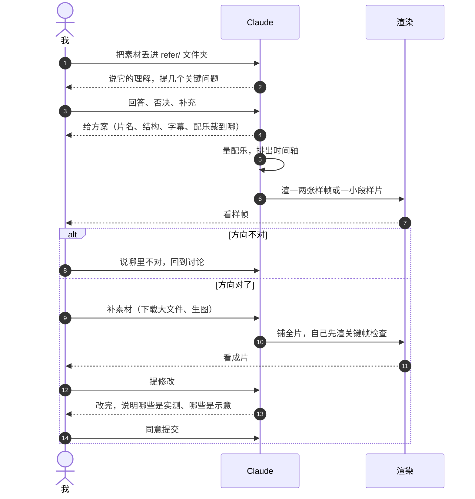
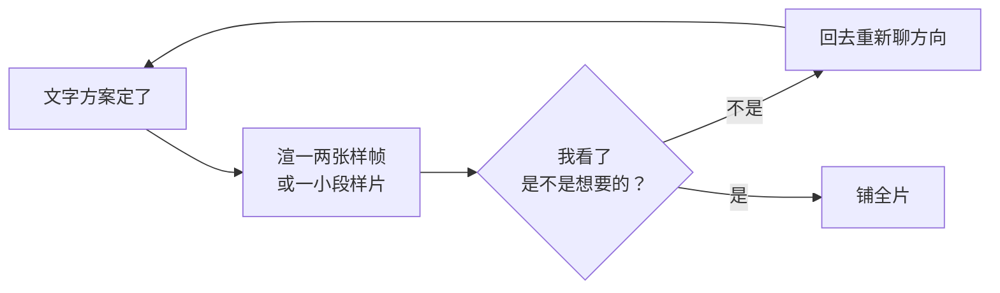
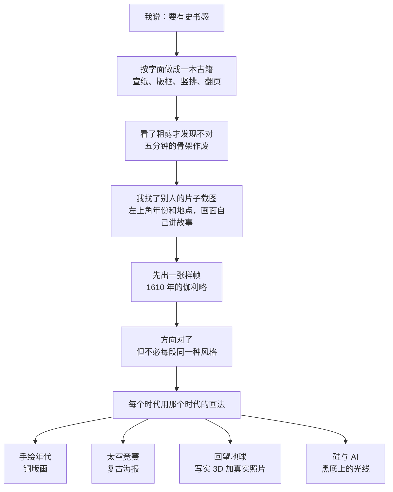
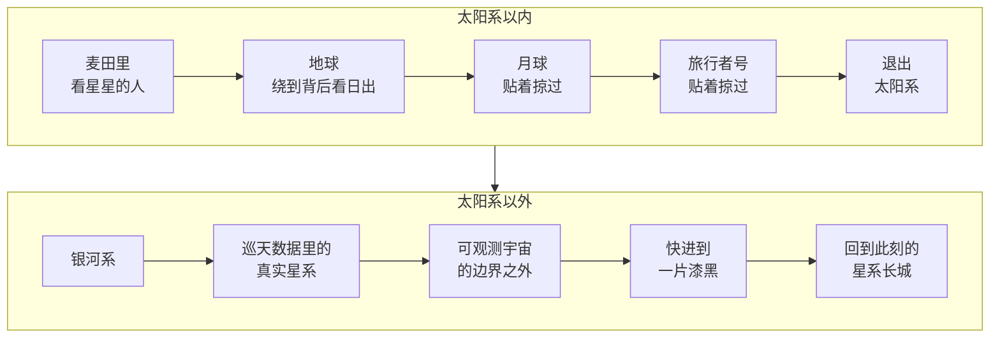

# 代码做视频：我和AI的四支片子与一套工作流

> 这几天我没开过剪辑软件，却做出来四支视频，每一帧都是代码渲染的。这里记一下我和 AI 是怎么配合的，哪些弯路走过一次就够了

***

***

> tags: [Remotion, Claude, Claude Code, AI视频, 视频制作, 工作流]

> github: https://github.com/pluchon/vedio_studio_remotion_personal

## 先说在前面

过去几天里我做了四支视频：两支日常随笔，一支五分钟的人类文明探索史，还有一支从麦田一路退到可观测宇宙之外的科普短片。全程没有打开任何剪辑软件，画面都是代码渲染出来的。代码是 Claude 写的（Claude Code 里的 Opus 5.5），我做的事情就四样：给素材、提想法、看样片、说哪里不对。

所以这篇不讲渲染代码怎么写，我也讲不了。我想记下来的是整个流程怎么转起来的，我给什么、它做什么、我们在哪些地方来回商量，还有哪些坑踩过一次就不用再踩。

## 用什么做的

视频用的是 [Remotion](https://www.remotion.dev/)。你可以把它理解成「一个按帧号渲染的网页」，第 0 帧画什么、第 300 帧画什么都由代码说了算，最后一帧一帧截下来合成 mp4。

听着有点绕，但用下来有几个地方特别省心。任何一帧都能单独渲出来看，改了哪里就看哪里，不用等整片渲完。时间也是精确的，一句字幕要落在配乐第 42.45 秒的重音上，代码里写的就是 42.45，不用手去拖。再就是每做完一个阶段提交一次，方向错了随时能退回去。后面整套流程其实都是靠这三点撑着的。

四支视频放在同一个工程里，共用一份依赖和一批通用组件，比如字幕、拍立得、胶片颗粒这些。每期视频自己一个目录，互不干扰。

## 一期片子是怎么做出来的

做到第四支，流程基本固定成了下面七步。前两支还在摸索，第三支被整个推翻过一次之后才定下来。

| 步骤 | 我做什么 | Claude 做什么 |
| --- | --- | --- |
| 1. 给素材 | 在 `refer/<期名>/` 放文章、照片、配乐 | 读完素材，说它的理解，提几个关键问题 |
| 2. 讨论方向 | 逐条回答、否决、补充 | 给方案，不动手写代码 |
| 3. 量配乐 | 不用管 | 分析配乐的起音、重音、爆发点，排出时间轴 |
| 4. 样帧或样片 | 看，说对不对 | 先渲一两张最能代表风格的画面，或者一小段 |
| 5. 补素材 | 下载大文件、用生图模型出图 | 给链接、存放路径和生图提示词，核对文件完整性 |
| 6. 铺全片 | 等 | 写完所有段落，自己渲关键帧检查，再渲成片 |
| 7. 看片与提交 | 看成片，提修改，同意后才提交 | 修改，说明哪些是实测、哪些是示意 |

把来回的过程画出来是这样的，中间有两处会打回去重来：

### 素材丢进一个文件夹

每期开工前，我在仓库的 `refer/` 下面建一个文件夹，比如 `refer/云_天空/`，手头有什么就丢什么进去：自己写的随笔、几张照片、一首想用的曲子。不用整理，也不用凑齐，第四期我只放了一个文档和一首曲子就开工了。这个文件夹不进版本库，所以随便放。

### 先聊清楚，不许直接做

这是我一开始就定下的规矩，拿到素材不许直接动手。

Claude 读完素材之后，会先讲它理解的主题，再问几个决定方向的问题。第一期它问的大概是：三篇随笔做成三支还是一支？横屏还是竖屏？准备发在哪里？想要什么气质？我的回答一般都很短，像「合成一支」「日记的记录，要很好、很自由」这种。它再根据这些给出片名、分章、字体、配乐裁到哪里，我一条条确认或者否掉。

片名和英文名、时长、结构、字幕有几句、照片怎么用，都是在这一步定的。定下来之后它会记进项目记忆，后面就不会回头再问一遍。

### 时间轴是从配乐里量出来的

我们不是先做画面再配音乐，而是反过来，每一期的时间轴都从配乐里量。

Claude 会去分析音频的响度变化，标出哪里起音、哪里是重音、哪里爆发、哪里屏息。第三期那首曲子将近五分钟，量出来有两次爆发，不只是结尾那一次，于是全片的两个高潮就排在这两处。第四期量得更细，有十几个重音点，镜头每到一站都踩在一个重音上。

我完全不懂乐理也没关系，它量完会直接告诉我这首曲子在哪几秒有什么，所以这一段该放什么。

### 先看样帧，再铺全片

这一条是第三期换来的教训，后面会细说。简单讲就是方向定了以后，先渲一两张最能代表风格的画面，或者一段几秒到几十秒的样片，我点头了再往下做。

原因很简单，方案里写一句「画面是一册古籍」，我读的时候根本想象不出它会长什么样，得看到画面才知道是不是我要的。

### 素材谁去拿

有些素材得从外面拿，做了几期之后分工也固定了。

大文件我来下载，我这边的网络比它直接下快得多。它给我官方链接、该放到哪个路径、文件大概多大，我放好之后它再用文件大小和哈希值核对有没有下坏。需要画的图也是我来，历史上没留下图像的场景（史前的人、祭司、史官），它写提示词，我拿去生图模型里出，再放回文件夹。第四期开头那段麦田俯拍，是我用图生视频做的八秒片段。

公开数据就交给它自己取，比如第四期的星系巡天数据要用查询接口分批拿，这件事我直接授权它做。不过下载之前要先看许可，有一份星表的说明里明写着不允许再分发，所以由它生成的数据文件就没有放进公开仓库。

### 铺全片，它自己先查一遍

方向和样片都确认之后，我一般会说一句「一次性做完」，这时候它才把所有段落写完。

写完也不是直接丢给我。它会把关键帧和每一处段落衔接的帧单独渲出来，自己先看一遍，发现问题先改。第四期就有一个只在连续渲染时才出现的问题，单独渲一帧是对的，整片渲出来某些渐变却不动。它是渲了一小段连续画面，再和单帧对比才找到的，这种问题换我自己是不可能发现的。

成片渲染很慢，五分钟的片子要渲很久，文件也大，所以它会另外压一份小的发给我看。

### 看片、改、提交

我看完成片，说哪里不对。说法经常很模糊，像「有点平淡」「像在放 PPT」。这时候它得自己判断原因，直接给我改过的版本，不能丢一串选项回来让我选。

交付的时候它会逐条讲清楚片子里哪些是实测数据、哪些是示意或者重建。比如第四期里，恒星和星系的位置是真实观测数据，但银河系的俯视图是按测量结果重建的，毕竟人类还没从外面拍过银河系。

还有一条，提交必须我点头，它不会自己提交代码。要么是我说「提交吧」，要么是它建议提交而我同意。每个阶段留一个提交，推翻重来的时候才有地方可退。

## 四支片子

### 第一期：《风经过的地方》

素材是三篇随笔（踩浪、暮色里散步、路上遇见一只小猫）、几张拼贴照片，还有一首钢琴与中提琴的曲子。我的要求是三篇合成一支，按主题分章，横屏，气质是日记，要自由。

这一期定下了后面一直沿用的一条：不做图片幻灯片。我当时说得很直接，不要把几张照片放大、缩小、平移就当成视频，那没有意义。照片只在关键的地方出现一下，其余的画面要自己设计。

于是猫的那一则，画面是深夜路灯下的一串爪印；海的那一则，是一条画出来的海岸线和沙滩上的脚印；暮色那一则，是一座被一笔一笔画出来的高架桥。照片以拍立得的样子落下来，停一会儿就走。

章节顺序是做完之后才调的。最初按文章顺序排，后来改成了猫、海、暮色，也就是事情真实发生的先后。

### 第二期：《云走过的地方，天空都记得》

素材是一篇随笔、四张天空的照片和一首钢琴曲。这次我想比上一期更自由，不要章节标题卡，一口气流下去。

结构是一个环。从图书馆的一扇窗开始，跟着一朵云出海、翻山、路过村庄，到黄昏，最后回到那扇窗，窗外已经是夜里了。

字幕是从原文里摘的。它先提了八句，我让它再加两句，而且每句都要精选。加进去的两句里有一句是「孩子把它看成一只羊，又看成一条龙」，为了这一句它专门做了云的形变，同一朵云从羊变成龙。

这一期还顺手把第一期里能复用的东西（手写感的字幕、拍立得、胶片颗粒）提成了通用组件。提完之后它把第一期重新渲了几帧，和原来的逐字节对比，确认没有把已经做好的片子改坏。

### 第三期：《我们一直在仰望》

素材是我写的一篇文章，讲人类从抬头看星星到造出 AI 的历程，加一首将近五分钟的曲子。要求比前两期多：整首曲子不裁，要有「史书感」，前两期都是平面的所以这期要有 3D，结尾引入 AI 作为未知变量。

这是工作量最大的一期，也是被推翻得最彻底的一期。

我说要「史书感」，Claude 按字面理解，做成了一本古籍，宣纸、版框、竖排文字、翻页全上了。整条五分钟的骨架都搭完了，我看了粗剪才发现不对。我说的史书是一幕一幕的叙事，不是真的一本书。

回头找原因，方案的文字里其实写了「画面是一册古籍」，我看过，也没反对，因为我从文字里根本想象不出实际的样子。从这以后我们才加了「先出样帧」这一步。像史书感、自由、日记感这类风格词，也要先问清楚指的是叙事的气质，还是具体的画面形式。

重新定方向的时候，我找了一段别人做的片子截图给它看，告诉它我喜欢的是那种左上角一个年份、一个地点，画面自己讲故事的形式。它先做了一张 1610 年伽利略的样帧，我说方向对了，顺便提了一句不必每一段都用同一种风格。

它接着提了个办法，每个时代用那个时代的画法。手绘年代用铜版画，太空竞赛年代用复古海报，回望地球的段落用写实的 3D 加真实照片，硅与 AI 的年代用黑底上的光线。最后全片 32 幕，按年代换了四种画法。

这一期涉及一大堆年份和数字，Claude 逐条上网核实过。有几处它主动纠正了我文章里的说法，比如某次古代的彗星记录不能直接说成哈雷彗星。也有反过来的情况，我文章里写了几件 2026 年夏天的事，它一开始以为不属实，查过之后发现是它自己的知识没更新到那时候。

3D 也是先打样的。动手做任何一幕之前，它先做了五秒钟的测试片，确认这台机器能用显卡渲染三维画面、速度也能接受，才往下做。

结尾我让它把自己放进去。最后一幕的年份标的是一个问号，画面上只有一句「我是 Opus 5.5。」

### 第四期：《光到不了的地方》

起因是第三期做完，我看到别人一支宇宙题材的片子，画面真实得不行，就去问 Claude 为什么。它的判断是那些画面是 AI 生成的视频片段，代码只负责叠字。生成视频擅长质感，但做不准数字和轨道，代码渲染正好反过来。

我再回头看第三期，每一幕单看都不错，连起来还是有点像在放 PPT。第四期的想法就是这么来的：讲光速、宇宙膨胀和事件视界，而且全片只有一个镜头。

我提的要求是用《星际穿越》里的一首曲子，不裁；视角慢慢拉大，最后是一片黑，是「很久以后的夜空那种黑」；要严谨但看得懂；不要像 PPT，可以大胆一点。

最后的方案是镜头从一个躺在麦田里看星星的人开始，一直往后退，退出地球、太阳系、银河系，直到可观测宇宙的边界之外，中间一刀不剪。开头几秒的麦田俯拍用我生成的视频片段，之后由三维画面接手。恒星和星系用的是真实的星表和巡天数据，画面里每一个点都是一个真实的天体。

第一版样片我不满意。我的原话是：方向对了，但还是有一点平淡，感觉缺了什么，是素材吗，还是表现方式？

它说问题在表现方式上。镜头是一条直线匀速后退，目标永远在画面正中，没有东西从镜头前经过，也没有任何一刻对上音乐。我又补了一句我想要的感觉：每到一个阶段性的距离就停下来，然后快速赶往下一个阶段，而且越来越快。

改过的版本动了这几处：

- 到站慢，赶路快。每到一个值得看的地方几乎停住，然后加速冲向下一站，每一站都落在配乐的一个重音上。
- 路线会拐弯。绕到地球背后看太阳从边缘露出来，贴着月球掠过，再贴着旅行者号掠过。
- 底部多了三个读数：距离、你看到的是多久以前、镜头的速度。速度以光速为单位，越往后越离谱，超过光速就变红。
- 数字要挂到能感受的东西上。比如「光走一天的路，它飞了四十九年」，说的是旅行者号。

整条镜头的路线大致是这样，一路只退不剪：

片头和结尾是我要求改的。片头不要一上来就是人趴在草地上，先让标题淡入几秒，再出现麦田，然后配乐才起。结尾也不要戛然而止，时间先快进到一片漆黑，再回到此刻的一片星系长城，留下一句话和一个问号。

结尾这句话我们还商量过分寸。我想暗示 AI 探索深空的可能性，Claude 提了两条限制：不用 AI 的第一人称自述，也不能暗示任何东西可以超过光速。最后定下来的是：

> 这么远的路，等得起的，也许不是我们。

这一期从开始讨论到成片，用了一天。

## 和它配合的几个细节

我说话很模糊，追问到能动手是它的事。「自由」「史书感」「平淡」这些词都没法直接执行。前两期它问得多，到第四期已经知道先问什么、哪些不用再问了。

它会反对我。史实不对会指出来，科学上说不通的表达不会照写，配乐有版权风险也会提醒。仓库公开之前，它主动查出提交记录里有我的私人邮箱、仓库里有商业配乐和生活照片，问过我之后把这些从历史里清掉了。

记忆是跨天的。每期定下的方向、我说过的偏好、踩过的坑，它都写成了笔记。第二天开新对话，我不用再讲一遍「不要做幻灯片」「先讨论再动手」。

需要我拿主意的地方，它给的是选择题。几个选项加上它自己的建议摆在那里，我多数时候回一句「都按你的建议来」就过去了。

我手里一直只握着两件事，方向和提交。画面怎么实现我不管，但片子讲什么、什么气质、什么时候算做完，是我说了算。

## 走过的弯路

1. 风格词被按字面做了。「史书感」做成了一本书，五分钟的骨架作废。后来的办法是先出样帧。
2. 以为平淡是素材不够，其实是镜头没设计，直线、匀速、不对拍。现在会先想好镜头经过哪里、在哪里慢下来，再谈画什么。
3. 单帧看着对，成片不对。有些问题只在连续渲染时才出现，所以动态效果要渲一小段连续画面来核对。
4. 数据许可没先看。有的公开数据不允许再分发，下载之前得先读使用条款。
5. 仓库公开前没清理。私人邮箱、照片、版权配乐都躺在历史里。公开之前要整体查一遍，不该公开的从历史里清掉。

## 写在最后

这四支片子里没有一帧是我亲手画的，也没有一行代码是我写的。可它们讲的都是我想讲的东西：一只蹭了我鞋的猫，图书馆窗外的一朵云，人类抬头看了几十万年的夜空，还有一条光永远到不了的界线。

做下来最花时间的反而不是渲染，是把「我想要的感觉」说清楚。实现这件事现在已经不怎么拦人了，拦人的是我自己得先想明白到底要讲什么。

## 附：署名与说明

- 配乐版权归原作者所有，没有放进仓库。四首依次是：花暦（鷹石忍）、Chill out、If I Should Return（Marcus Warner）、Cornfield Chase（Hans Zimmer）。
- 第四期的数据来源：HYG v4.4 星表（CC BY-SA 4.0）、2MASS Redshift Survey（Huchra 等，2012）、SDSS DR18、ESA/Planck Collaboration 的微波背景图。
- 第三期的行星贴图来自 Solar System Scope（CC BY 4.0），史料图版来自 NASA 与公有领域图像。
- 字体：霞鹜文楷、思源宋体。
